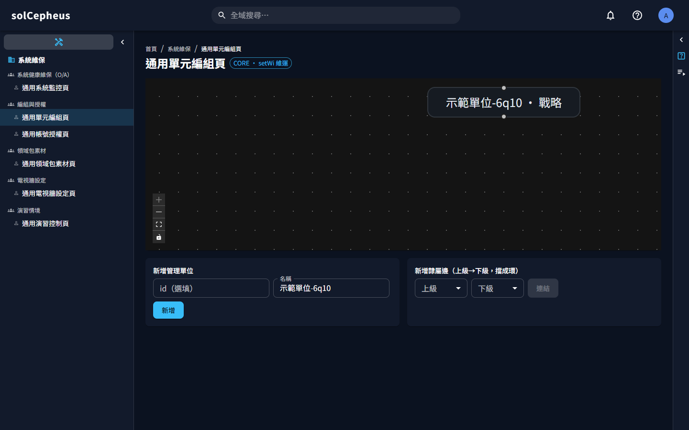
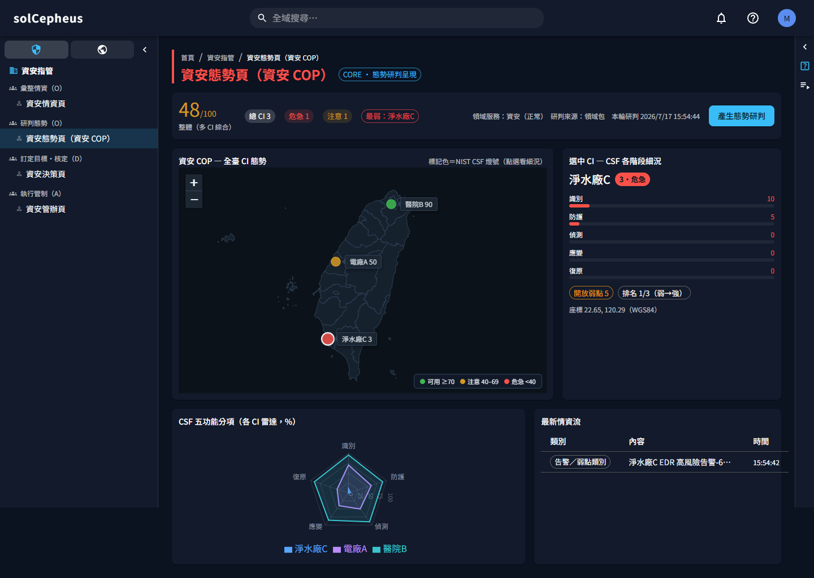
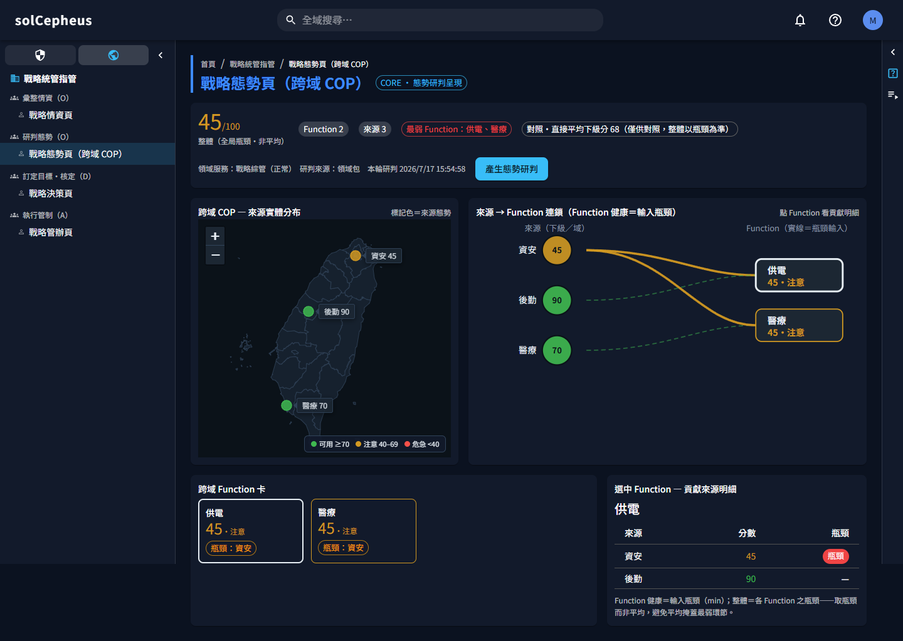
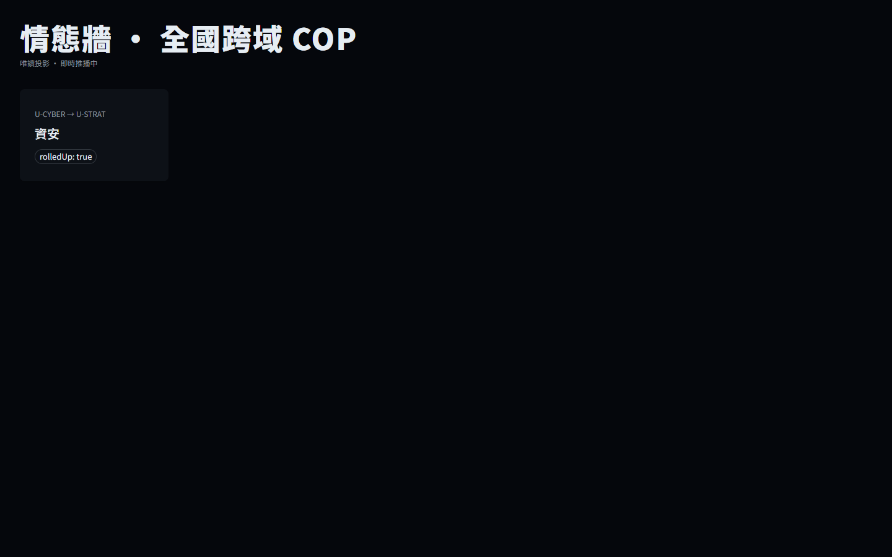
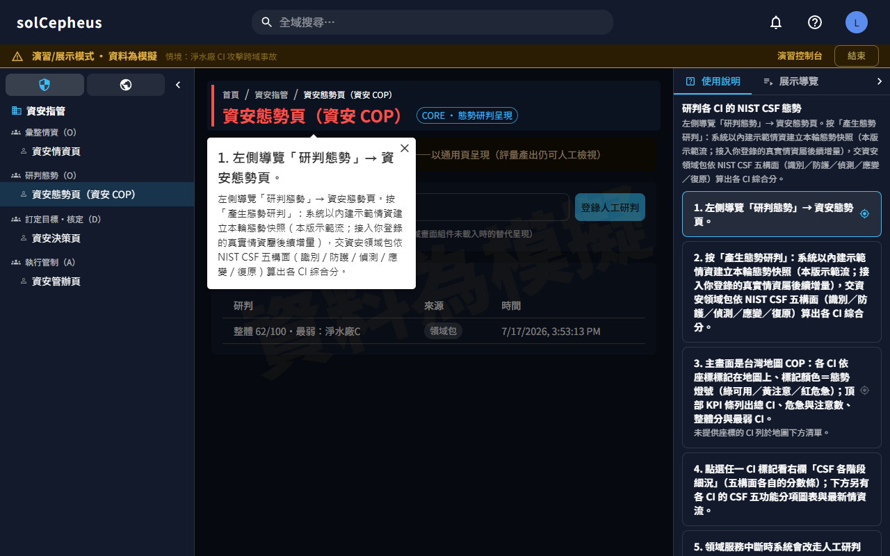
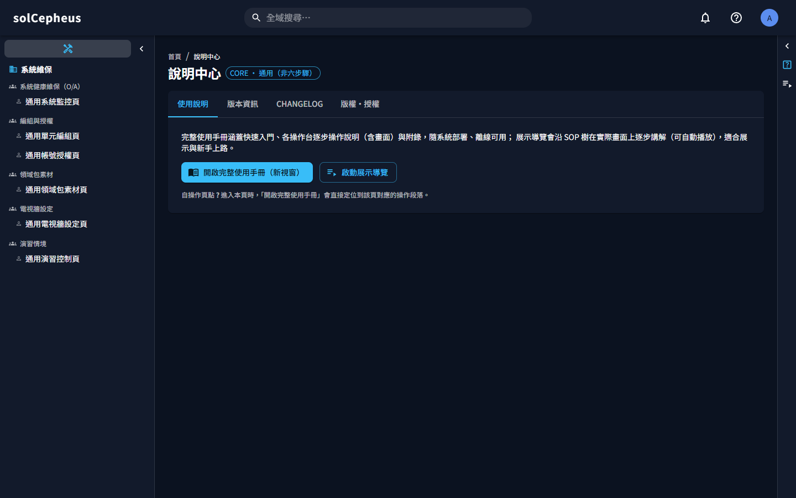
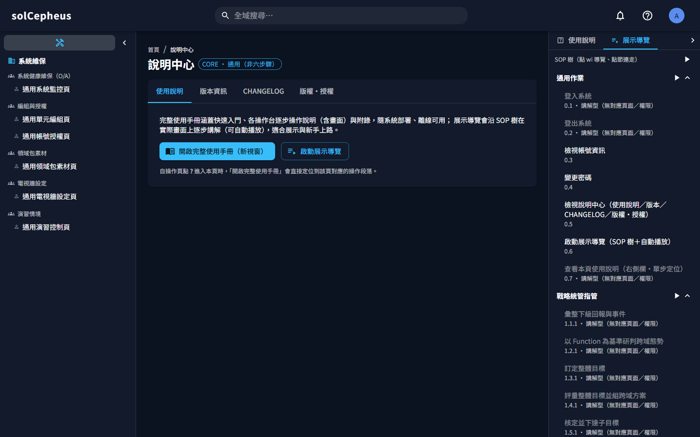
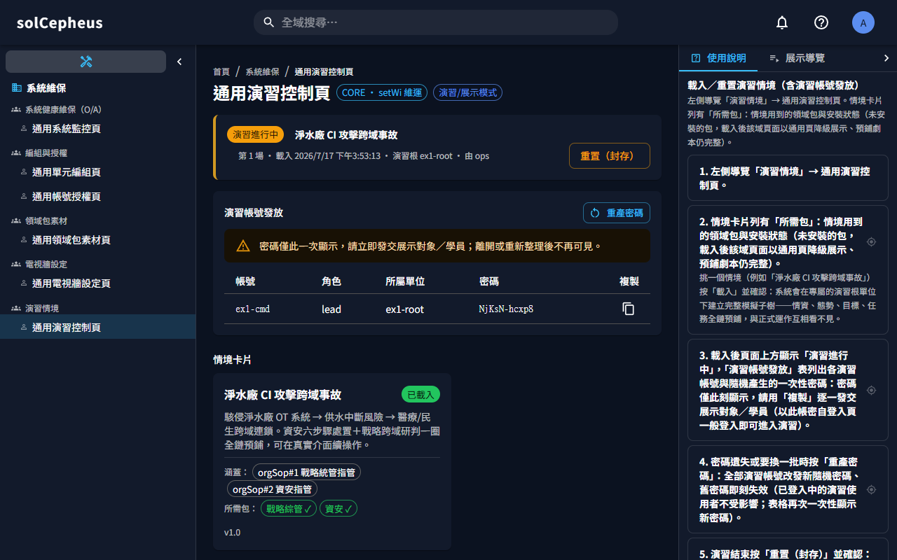

# solCepheus — 可組合跨域指揮管理平台

> 📘 **完整使用手冊**：[PDF 版（含完整目錄）](docs/solCepheus-manual.pdf) ｜ 站內版 `/manual/`（登入後自說明中心（右上角 `?`）開啟、直達當前頁說明）
> 手冊涵蓋部署、登入到每一步操作的逐項說明與畫面；本 README 為對應的入口簡介。

## 產品概述

solCepheus 讓一個跨層級、跨專業領域的指揮管理組織，在**同一套平台**上運作：每個管理單位承接上級目標（Objective）、研判自己領域的態勢、做出決策，再把成果回報上去。單位要增加、層級要加深、領域要更換，都用**圖形化編組與掛載**完成，不必改版系統。

平台把「指揮管理」拆成兩件事：

- **管理核心**：所有單位共用的目標承接、決策、任務、回報與稽核紀錄——這部分不分領域、永遠一致。
- **領域包**：各專業領域（資安、戰略綜管，後續人力、後勤）的態勢模型、評量方法與專業畫面——像插件一樣掛到單位上，可獨立部署、獨立更換。

本版（MVP）以**資安**與**戰略綜管**兩個領域包，驗證從單一領域指管到跨域統管的完整運作。

## 運用想定

三層指揮結構，本版實作戰略＋戰術兩層：

- **戰略層**掌握全局實體（發電廠、醫療中心、堰塞湖等關鍵基礎設施），研判跨域連鎖衝擊，指示戰術層處置目標。
- **戰術層**（如資安統管）用專業方法論（NIST CSF）掌握多個關鍵基礎設施的領域態勢，調度作業小組。
- **戰鬥層**小組（資安管理／防護建置／檢測／應變、運輸車隊）在本版為調度對象，後續增量展開。

你在平台上的角色：

| 你是…… | 你會…… |
|---|---|
| **戰略指揮官／戰略參謀** | 在戰略操作台匯整下級回報與外部事件、研判跨域態勢、訂整體目標、核定跨域方案、下達子目標並追蹤重評 |
| **資安指揮官／資安分析員** | 在資安操作台掌握多個關鍵基礎設施的 NIST CSF 態勢、訂各設施資安目標、核定並調度下屬小組、彙整回報上送 |
| **維運工程師／維運組長** | 在維運台部署系統、開帳號與授權隔離、拖拉編組管理單位拓樸、載入與套用領域包、設定電視牆、監控健康 |
| **指揮中心（電視牆）** | 情態牆全螢幕投影即時共同作戰圖（COP）——下級回報上送後**數秒內**自動反映（WebSocket 推播；斷線自動退回輪詢並重連） |
| **展示對象／受訓學員** | 用維運發的演習帳號登入，從說明中心啟動展示導覽——依職責層層展開（職責→作業→操作）點哪導哪、可自動播放，在預鋪模擬情境的真實介面上體驗 |

## 安裝（Kubernetes／Helm）

系統以 Helm chart 部署到你的 Kubernetes 叢集：可用 umbrella chart 一鍵裝核心＋官方兩包，也可核心與各領域包分開裝。安裝分三步：跑環境檢查 → `helm install` → 裝後確認。

**安裝前環境檢查（請先跑）**：chart 的 `ingress.className` 預設留空＝交給叢集的**預設 ingress controller**；這招只在叢集真的有標「預設 IngressClass」時有效（k3s 內建 traefik 出廠即標；ingress-nginx 官方安裝**不標**——留空會產生沒人認領的孤兒 Ingress、網址無聲 404）。安裝前請先跑下列檢查腳本（**整段複製執行**——分段貼上會沿用舊變數而誤判），依輸出指引安裝：

腳本輸出的 `--set` 依你的安裝動線擇一：**umbrella 一鍵安裝**用 `solcepheus-syscepheus-chart.ingress.*` 開頭的鍵；**核心 chart 單獨安裝**用 `ingress.*` 開頭的鍵（鍵擺錯層值透不進去，等同沒設）。

bash 版：

```bash
# solCepheus 安裝前環境檢查：偵測叢集預設 IngressClass（請整段複製執行）
if ! CLASSES=$(kubectl get ingressclass -o name 2>/dev/null); then
  echo "[X] kubectl 連不上叢集：請先確認 kubeconfig 與叢集狀態（kubectl get nodes）再重跑本檢查。"
else
  DEFAULT=$(kubectl get ingressclass -o jsonpath='{range .items[*]}{.metadata.name}{"\t"}{.metadata.annotations.ingressclass\.kubernetes\.io/is-default-class}{"\n"}{end}' 2>/dev/null | awk -F'\t' '$2=="true"{print $1}')
  NDEFAULT=$(printf '%s' "$DEFAULT" | grep -c .)
  if [ -z "$CLASSES" ]; then
    echo "[X] 叢集沒有任何 IngressClass：請先安裝 ingress controller（如 ingress-nginx／traefik），或安裝時停用 Ingress 改走 port-forward——umbrella 加 --set solcepheus-syscepheus-chart.ingress.enabled=false（核心 chart 單獨裝則 --set ingress.enabled=false），裝後 kubectl port-forward svc/modweb 8080:80 開 http://localhost:8080。"
  elif [ "$NDEFAULT" -eq 1 ]; then
    echo "[OK] 叢集預設 IngressClass=${DEFAULT}：ingress.className 留空即可，直接安裝。"
  elif [ "$NDEFAULT" -gt 1 ]; then
    echo "[!] 叢集標了多個預設 IngressClass（${DEFAULT//$'\n'/、}）——留空會被 K8s 拒絕建立，請明示其一：umbrella 加 --set solcepheus-syscepheus-chart.ingress.className=<名>（核心 chart 單獨裝則 --set ingress.className=<名>）。"
  else
    echo "[!] 叢集有 IngressClass 但未標預設：umbrella 安裝加 --set solcepheus-syscepheus-chart.ingress.className=<名>（核心 chart 單獨裝則 --set ingress.className=<名>）。可用名稱："
    echo "${CLASSES}" | sed 's|ingressclass.networking.k8s.io/||'
  fi
fi
```

PowerShell 版（Windows PowerShell 5.1 與 PowerShell 7 皆可）：

```powershell
# solCepheus 安裝前環境檢查：偵測叢集預設 IngressClass（請整段複製執行）
$raw = kubectl get ingressclass -o json 2>$null
if ($LASTEXITCODE -ne 0 -or -not $raw) {
  Write-Host "[X] kubectl 連不上叢集：請先確認 kubeconfig 與叢集狀態（kubectl get nodes）再重跑本檢查。"
} else {
  $items = @(($raw | ConvertFrom-Json).items)
  $default = @($items | Where-Object { $_.metadata.annotations.'ingressclass.kubernetes.io/is-default-class' -eq 'true' })
  if ($items.Count -eq 0) {
    Write-Host "[X] 叢集沒有任何 IngressClass：請先安裝 ingress controller（如 ingress-nginx／traefik），或安裝時停用 Ingress 改走 port-forward——umbrella 加 --set solcepheus-syscepheus-chart.ingress.enabled=false（核心 chart 單獨裝則 --set ingress.enabled=false），裝後 kubectl port-forward svc/modweb 8080:80 開 http://localhost:8080。"
  } elseif ($default.Count -eq 1) {
    Write-Host "[OK] 叢集預設 IngressClass=$($default[0].metadata.name)：ingress.className 留空即可，直接安裝。"
  } elseif ($default.Count -gt 1) {
    Write-Host "[!] 叢集標了多個預設 IngressClass（$($default.metadata.name -join '、')）——留空會被 K8s 拒絕建立，請明示其一：umbrella 加 --set solcepheus-syscepheus-chart.ingress.className=<名>（核心 chart 單獨裝則 --set ingress.className=<名>）。"
  } else {
    Write-Host "[!] 叢集有 IngressClass 但未標預設：umbrella 安裝加 --set solcepheus-syscepheus-chart.ingress.className=<名>（核心 chart 單獨裝則 --set ingress.className=<名>）。可用名稱："
    $items | ForEach-Object { Write-Host $_.metadata.name }
  }
}
```

> 註：預設 IngressClass 只在 Ingress 物件**建立當下**蓋章——若曾以 `--set ingress.className=<名>` 安裝、之後叢集補標了預設想改回留空，須讓 Ingress 物件重建才會被預設 controller 接手：先 `kubectl delete ingress modweb`、**再** `helm upgrade`（Helm 會重建缺失的 Ingress；controller 不會自行重建被刪的物件，順序顛倒會讓對外入口一直斷到下次 upgrade。注意 upgrade 時勿帶 `--reuse-values` 或舊的 `--set ingress.className`，否則留空不會生效）。

一鍵聚合安裝（核心＋官方兩包，安裝程序自動完成包登記；chart 直接從 GHCR 取得，不需下載原始碼）：

```bash
helm install cepheus oci://ghcr.io/twstellerwhale-ocean2/solcepheus-chart \
  --set solcepheus-syscepheus-chart.ingress.baseDomain=你的網域   # 對外網址＝solcepheus.你的網域；純內網/port-forward 可省略（詳下方 Ingress 段）
```

或核心（零領域包）與各領域包分開安裝——各包自帶 image／chart、可單獨升級替換：

```bash
helm install cepheus-core   oci://ghcr.io/twstellerwhale-ocean2/solcepheus-syscepheus-chart
helm install pack-cyber     oci://ghcr.io/twstellerwhale-ocean2/solcepheus-syspackcyber-chart
helm install pack-strategy  oci://ghcr.io/twstellerwhale-ocean2/solcepheus-syspackstrategy-chart
```

裝好後確認：modCore `/healthz` 回 200、modWeb 首頁可載入、素材頁可見兩官方包「可達／已套用」；有啟用 Ingress 者另跑 `kubectl get ingress modweb` 確認 `CLASS` 欄**不是** `<none>`（`<none>`＝孤兒 Ingress、對外網址會無聲 404，請回頭跑上方環境檢查）。

> **安裝需要網路**：chart 內的 image 指向 GHCR（`ghcr.io/twstellerwhale-ocean2/…`，public），叢集安裝時會直接自 GHCR 拉取。GitHub Release 附的 chart `.tgz`（含 SHA256）可先下載留存與驗證，但目前**不支援全離線安裝**——拉取 image 仍需對外網路；封閉網段部署請先把 image 匯入你的私有 registry，再以 `--set` 覆寫各 image 位址。
>

> **對外可達（Ingress）**：chart 預設附 opt-in Ingress（`ingress.enabled: true`），將外部 `host → modweb:80`；app 內部 path 路由（`/api`、`/packs/{slug}`、SPA）仍由 modWeb nginx 處理。
>
> - **host**：預設由 `solcepheus.<baseDomain>` 鏈導出（`baseDomain` 預設中性值 `local`，chart 不硬編任何公開網域）——請以 `--set ingress.baseDomain=你的網域` 一處設定共用網域值，即得對外 host `solcepheus.你的網域`；host 要完全自訂時改 `--set ingress.host=你要的host`（優先於預設鏈）。**用 umbrella 一鍵安裝時鍵名須帶子 chart 前綴**（`--set solcepheus-syscepheus-chart.ingress.baseDomain=…`，見下）。
> - **controller（`className`）**：預設**留空** → 交給叢集的**預設 IngressClass**（前提是叢集有標預設——k3s traefik 出廠即標、免 `--set`；ingress-nginx 官方安裝**不標**，須 `--set ingress.className=nginx`）；同叢集多 controller 也須明示。**裝前請先跑上方「安裝前環境檢查」腳本**，依輸出決定要不要帶 `--set`。
> - **邊緣須先備妥**（chart **不含**邊緣本體，二擇一）：① **外部邊緣終結 TLS**（如 Cloudflare Tunnel：萬用 `*.<baseDomain>` 設定一次、之後掛 app 不再碰邊緣）→ 維持預設 `ingress.tls=false`、`ingress.issuer=""`（TLS 在邊緣）；② **自架 ingress-nginx＋cert-manager** → `--set ingress.issuer=<ClusterIssuer>`（chart 自動加 `cert-manager.io/cluster-issuer` annotation 並產 TLS，例 DuckDNS ACME issuer）。
> - **純內網／`kubectl port-forward`**：`--set ingress.enabled=false` 回退 ClusterIP-only、不產生 Ingress 物件。
> - umbrella 於 `solcepheus-syscepheus-chart.ingress` 透傳同組值（如 `--set solcepheus-syscepheus-chart.ingress.baseDomain=你的網域`）。

> 逐步安裝、參數與疑難排解，見完整使用手冊「快速入門」與「功能與操作說明」；歷次版本的升級注意事項（含改名遷移）見 [`CHANGELOG.md`](CHANGELOG.md) 與各版 Release notes。

> 登入逾時（token 失效、伺服器重啟等）時系統會自動登出並導回登入頁、提示「登入逾時，請重新登入」；權限不足（403）不會登出、在原頁就地提示。

## 走一圈看看（使用者旅程）

以維運 → 資安 → 戰略 → 電視牆的順序，把平台跑一輪（本版各態勢研判以內建示範資料演算；接入真實情資源屬後續增量）：

**1. 維運台——把組織搭起來。** 在通用單元編組頁用拖拉方式編組管理單位拓樸（層級由拓樸自動推導），在領域包素材頁掃描探索叢集內的領域包、確認登記，再套用到指定單位：



**2. 資安操作台——跑一輪六步驟。** 資安單位從情資蒐集開始，在資安態勢頁的台灣地圖 COP 上看多個關鍵基礎設施的位置、NIST CSF 燈號與瓶頸（點選任一設施看五功能細況），接著訂目標、擬方案、核定調度小組、彙整回報上送：



**3. 戰略操作台——跨域統管。** 戰略單位匯整下級回報與外部事件，在戰略態勢頁的跨域 COP（台灣地圖上的實體分布＋Function×實體連鎖圖）以關鍵基礎設施的功能（Function）為整合基準重新研判跨域連鎖（不是把下級分數拿來平均），訂整體目標、下達子目標：



**4. 情態牆——讓指揮中心看見。** `/wall` 全螢幕投影即時 COP：



其餘畫面：[登入](docs/manual-assets/wi-0-1.png)｜[戰略決策頁](docs/manual-assets/wi-1-3-1.png)｜[資安情資頁](docs/manual-assets/wi-2-1-1.png)｜[領域包素材頁（掃描探索）](docs/manual-assets/wi-3-8-1.png)｜[系統監控頁](docs/manual-assets/wi-3-1-1.png)｜[外部領域包叢集探索](docs/manual-assets/10-pack-discover-dialog.png)｜[外部領域包登記（叢集）](docs/manual-assets/11-pack-external-registered.png)｜[登入逾時提示](docs/manual-assets/12-login-expired.png)｜[API 錯誤友善呈現](docs/manual-assets/13-friendly-error.png)｜[情態牆認證失效自動重試](docs/manual-assets/14-wall-authfail.png)｜[演習導覽（橫幅＋浮水印）](docs/manual-assets/15-exercise-banner.png)｜[重置後訪客導出](docs/manual-assets/16-exercise-reset-expired.png)｜[領域包中斷時域頁降級通用頁（不白屏）](docs/manual-assets/17-pack-wui-fallback.png)——每個操作步驟的畫面見完整使用手冊。

> 介面右上角：全域搜尋與告警（本版為預留介面）、**說明中心**（`?` 開站內 [通用說明頁]：使用說明·開手冊·啟動導覽／版本資訊／CHANGELOG／版權·授權）、**帳號選單**（帳號資訊／變更密碼／登出）。
> 介面**右側欄**（可收合）固定兩個分頁，跟著你所在的頁面走：**使用說明**——條列本頁作業的每一步，點某一步就在畫面上高亮該去哪裡、怎麼操作；**展示導覽**——依職責層層展開的導覽樹與自動播放。左側功能選單依「分類（圖示頁籤）→ 職責 → 作業 → 操作」層層對應、各層有圖示，也可收合成細軌讓主畫面滿版。


> 每頁頁首有**麵包屑**（`首頁 / 區段 / 當前頁`）：點「首頁」回到**你登入後的落點**（維運人員→系統監控頁；指管人員→你單位領域的態勢頁；已在落點時「首頁」不可點）；中段為所屬區段標籤（不可點）、末段為當前頁。帳號資訊與說明頁不屬任一區段，縮為 `首頁 / 當前頁`。

## 演習／展示模式

系統功能完整但複雜，所以內建演習/展示能力，讓展示、採購評估、教育訓練與新人上手不必從空系統開始：

1. **載入情境**：維運在演習控制頁挑一張情境卡片（本版內建「淨水廠 CI 攻擊跨域事故」）按載入，整個平台立刻被模擬資料灌滿——情資有告警、態勢有燈號、目標有內容、任務進行中，全部在真實介面上操作；載入後把頁面上列出的**演習帳號**發給展示訪客或學員登入。情境是資料資產（一情境一 JSON），新增情境不必改程式。
2. **依職責層層展示**：從說明中心（`?`）按「啟動展示導覽」，右側滑出**導覽面板**——依職責分節條列系統全部操作步驟（各步驟標 SOP 編號、依作業順序排列），點哪一項就在真實畫面上導覽哪一項（高亮＋講解氣泡＋開手冊此節），點職責旁的播放鍵則從頭連走整段；面板附**播放列**（播放／暫停／速度／進度），可全自動播放給現場看。





3. **放心演、隨時重來**：演習資料掛在專屬的演習單位子樹下，與正式運作互相看不見；演習帳號的畫面全程有「演習/展示模式 · 資料為模擬」色帶橫幅與浮水印。按重置即封存本輪（演習帳號隨之失效）、可再載入重來，**不會刪除或影響任何正式紀錄**。正在做正式作業的使用者完全不受演習影響、也不會看到演習標示。

> 展示導覽是登入後的產品能力（不載入演習情境也能導覽，只是頁面沒料）；登入頁不設任何展示或手冊入口。



操作步驟見完整使用手冊「載入／重置演習情境」「檢視說明中心」「啟動展示導覽」各節。

## 效益

用了 solCepheus，你的組織會得到：

- **擴編不改版**：新增管理單位、加深層級、換掛領域包，都是編組與掛載操作，系統不必改版重佈。
- **目標一條鏈**：同一個目標從上級交辦到下級承接是同一筆資料的不同視角，不複製、不漂移；從情資到回報全程可追溯、正式紀錄不可竄改。
- **專業可插拔**：所有領域包（含官方資安／戰略綜管）都是獨立部署的外掛（自帶 image／chart／畫面），裝上去、換版本，核心一字不改；核心 release 本身零領域包。
- **跨域不失真**：戰略層以 Function 重新研判下級異質成果，明確禁止「把下級分數拿來平均」的假統管。
- **出事守得住**：領域服務中斷時核心目標、命令、任務、回報無損，可切人工研判接手，恢復後留有完整稽核。
- **權限有牆**：可見範圍由授權與拓樸決定，越權必拒且留下稽核紀錄。
- **錯誤不嚇人**：登入逾時自動導回重登、不卡在失效畫面；操作錯誤一律顯示可理解的文案，不會蹦出原始 API 回應。
- **展示訓練不冒險**：內建演習情境連正式環境都能安全展示——模擬資料與正式運作隔離、明確標示、重置不損任何紀錄；隔離用的正是系統自己的單位授權機制，演習本身就是隔離能力的展示。

各項效益的量測方式與驗收證據，見完整使用手冊附錄。


## 部署與文件

- 部署：核心為單一 Helm release（`sysCepheus/deploy`，零領域包）；所有領域包各自 image／chart 獨立 `helm install`（官方包與第三方同級），維運台可掃描探索並確認掛載；umbrella chart 提供核心＋官方包一鍵安裝。
- 機密：`secrets.jwtSecret`、`secrets.dbPassword` 於部署時設定。
- 版本與改版紀錄：[`VERSION`](VERSION)／[`CHANGELOG.md`](CHANGELOG.md)；手冊附錄同步引用。
