<!-- gen:title:begin -->
# 綜合跨域指揮管理系統（solCepheus）
<!-- gen:title:end -->

# I. 系統簡介

## A. 運用想定

<!-- gen:story:begin -->
大型救災動員須臨時把行政、運輸等不同單位編成一個指揮體系：編組要快速成形、隨任務擴編收攏，過程全程留痕。既有系統依單一機關各建一套，臨時聯合只能靠電話與群組拼裝，無法因應大型災害管理需求。
本方案長期目標為建構可彈性組合的指揮管理平台：每個單位是同型指管基元、遞迴成指揮樹，專業以主題包插拔，單位間互動走共享持久紀錄。目前先聚焦於運輸調度指管主題包的實作與驗證。
<!-- gen:story:end -->

<!-- hand:story:begin -->
CEPHEUS 把「接收要求→彙整情資→定方向→擬方案→做決策→發命令→追進度→回報成果」這一圈收進同一個平台：每個管理單位是一個同型的基元，單位之間以上下級關係組成指揮樹，往來一律落成共享持久紀錄——不靠誰在線上，也不怕事後對不上帳。行政、運輸等專業內容以「主題包」承載，掛上就能用、卸下平台照跑。
<!-- hand:story:end -->

## B. 功能特色

<!-- gen:features:begin -->
* **建構可動態組合的指管平台**：每個單位都要做的六步指管，由平台集中做一次，各專業不必重做。平台另外提供各專業共用的資料存取，以及整個網站的主架構。專業內容由主題包掛上，掛上、卸下都不改平台。各專業的商業邏輯放在主題包，平台不管。
* **運輸調度指管主題包**：運輸調度單位裝上就能用。功能包含車輛、駕駛、客戶資料，叫車受理，派車安排與核定，駕駛接辦回報，例外告警。
  * **業務代客登錄叫車**：客戶打電話口述需求，由業務登錄叫車單，並維護客戶、車輛、駕駛資料。客戶不登入系統。
  * **派車衝突即時告警〔AI輔助〕**：派車單存檔和核定時，系統檢查並告警，但不擋存。檢查四種情形：同一台車或同一位駕駛的時段重疊；指派的人車不可用；車種或載量不符；駕駛工時超過法定門檻。受理叫車時，疑似重複也告警。
  * **派車建議〔AI輔助〕**：系統依待派的叫車單、車輛、駕駛和可用時段，產生一份派車建議。業務調整後存成派車單，經負責人核定才送給駕駛。
  * **駕駛網頁接辦回報**：派車單核定後送給被指名的駕駛。駕駛用手機瀏覽器接辦和回報。
<!-- gen:features:end -->

# II. 系統設置與快速驗證

## A. 安裝部署

<!-- gen:deploy:begin -->
依 `prsnOpr#A1.1.0-平台核安裝升級`（系統管理員）執行：
* [privOpr安裝Helm類系統](#1-privopr安裝helm類系統)（系統管理員）
* [privOpr升版Helm類系統](#2-privopr升版helm類系統)（系統管理員）
* [privOpr回滾Helm類系統版本](#3-privopr回滾helm類系統版本)（系統管理員）

依 `prsnOpr#A1.2.0-主題包安裝升級`（系統管理員）執行：
* [privOpr安裝Helm類系統](#1-privopr安裝helm類系統)（系統管理員）
* [privOpr升版Helm類系統](#2-privopr升版helm類系統)（系統管理員）
* [privOpr回滾Helm類系統版本](#3-privopr回滾helm類系統版本)（系統管理員）

依 `prsnOpr#A2.1.0-系統參數設定`（系統管理員）執行：
* [privOpr調整Helm類系統參數](#4-privopr調整helm類系統參數)（系統管理員）
* [privOpr設定AI推論服務](#5-privopr設定ai推論服務)（系統管理員）
* [privOpr設定TLS憑證](#6-privopr設定tls憑證)（系統管理員）
* [privOpr輪替機敏值](#7-privopr輪替機敏值)（系統管理員）

依 `prsnOpr#A3.2.0-系統備份檢修`（系統管理員）執行：
* [privOpr巡檢Helm類系統](#9-privopr巡檢helm類系統)（系統管理員）
* [privOpr停止Helm類系統服務](#10-privopr停止helm類系統服務)（系統管理員）
* [privOpr恢復Helm類系統服務](#11-privopr恢復helm類系統服務)（系統管理員）
* [privOpr重啟Helm類工作負載](#12-privopr重啟helm類工作負載)（系統管理員）
* [privOpr建立資料備份](#13-privopr建立資料備份)（系統管理員）
* [privOpr還原資料備份](#14-privopr還原資料備份)（系統管理員）

依 `prsnOpr#A4.1.0-平台核卸除`（系統管理員）執行：
* [privOpr解除安裝Helm類系統](#15-privopr解除安裝helm類系統)（系統管理員）

依 `prsnOpr#A4.2.0-主題包卸除`（系統管理員）執行：
* [privOpr解除安裝Helm類系統](#15-privopr解除安裝helm類系統)（系統管理員）
<!-- gen:deploy:end -->

## B. 帳密管理

<!-- gen:account:begin -->
* [privOpr建立USR帳號](#1-privopr建立usr帳號)（系統管理員）
* [privOpr停用USR帳號](#2-privopr停用usr帳號)（系統管理員）
* [privOpr恢復USR帳號](#3-privopr恢復usr帳號)（系統管理員）
* [privOpr重設USR密碼](#4-privopr重設usr密碼)（系統管理員）
* [privOpr指派群組成員](#5-privopr指派群組成員)（系統管理員）
* [privOpr緊急復原管理帳號](#8-privopr緊急復原管理帳號)（系統管理員）
* [privOpr變更本人密碼](#2-privopr變更本人密碼)（全體已登入使用者）
* [privOpr維護本人資料](#1-privopr維護本人資料)（全體已登入使用者）
<!-- gen:account:end -->

<!-- hand:account:begin -->
### 小編制的系統管理員配置

* **管理帳號專用**：系統管理員另開專用管理帳號，不與任何業務帳號共用、也不加入任何業務席；兼任管理員的人，日常業務仍以本人業務帳號登入。
* **「本人」以帳號判定**：禁止指派本人帳號、請假不得自核、擬案或最後更正者不得核定與結案，皆比對帳號而非自然人。
* **指派由管理帳號操作**：席指派、停用與恢復帳號一律以管理帳號於帳號授權頁辦理，全程留稽核日誌、不可刪改。
* **無人可專任時**：可委託系統廠商代管管理帳號，公司自持業務帳號與負責人席。
* **編制過小時**：擬案與核定、更正與結案無法分由不同帳號辦理者，由管理員於部署參數啟用職責分離之「小編制例外」；系統照常放行但標例外旗標，管理員定期自系統監控頁取例外報表交負責人覆核。
<!-- hand:account:end -->

## C. 運作安全

<!-- gen:security:begin -->
* [privOpr查詢系統日誌](#1-privopr查詢系統日誌)（系統管理員）
* [privOpr匯出系統日誌](#2-privopr匯出系統日誌)（系統管理員）
* [privOpr查詢效益指標](#3-privopr查詢效益指標)（系統管理員）
* [privOpr查詢系統資料](#4-privopr查詢系統資料)（系統管理員）
<!-- gen:security:end -->

## D. 展測驗證

<!-- gen:quickcheck:begin -->
**背景**：協弘運輸公司之「運輸調度辦公室」承辦日常接單派車。前置為兩 chart 已安裝、AI 推論服務已設定、「職責分離」小編制例外已啟用；步序依「測試時鐘」推進。
**項目**：
* `testReq#1-掛包建單位與開帳`：維運掛運輸調度主題包、建運輸調度辦公室、開帳並將各員加入席。
* `testReq#2-協弘上手與資料整理`：使用說明問答、車輛檔、駕駛檔、客戶檔、車輛不可用時段與駕駛請假。
* `testReq#3-叫車與重複叫車告警`：受理三件叫車，誤重登即告警並取消誤登件。
* `testReq#4-派車、AI 派車建議與衝突告警`：AI 建議候選、業務調整、存檔衝突告警、負責人逐張核定與退回。
* `testReq#5-送出與接辦`：核定後自動送出並列印派車單、駕駛手機接辦、逾時未接辦告警。
* `testReq#6-改派與例外`：駕駛婉拒與請假後重新安排、逾時未派、客戶取消、車輛故障改派。
* `testReq#7-回報、匯出與演訓帳號停用`：進度、代登與完成回報、叫車單結案、匯出營業資料、停用演訓專用帳號。

1. [prsnOpr#A6.1.0-主題包掛載管理](#prsnopra610-主題包掛載管理prsn系統管理員)（系統管理員）→ [privOpr熱載入主題包](#1-privopr熱載入主題包)：於「頁面主題包掛載頁」熱載入運輸調度主題包
2. [prsnOpr#A6.2.0-指揮樹編組維護](#prsnopra620-指揮樹編組維護prsn系統管理員)（系統管理員）→ [privOpr建立單位](#1-privopr建立單位)：建立「運輸調度辦公室」（協弘，`org運輸部門` 之 `team調度組`）
3. [prsnOpr#A6.2.0-指揮樹編組維護](#prsnopra620-指揮樹編組維護prsn系統管理員)（系統管理員）→ [privOpr套用主題](#6-privopr套用主題)：運輸調度主題套至運輸調度辦公室
4. [prsnOpr#A2.2.0-全般帳號管理](#prsnopra220-全般帳號管理prsn系統管理員)（系統管理員）→ [privOpr建立USR帳號](#1-privopr建立usr帳號)：動員前一日（測試時鐘設前一日 0900）：為全部編制人員開立帳號——業務陳小姐、負責人林經理、駕駛王大明、李小華、張志強，另開演訓專用帳號「演訓員甲」
5. [prsnOpr#A2.2.0-全般帳號管理](#prsnopra220-全般帳號管理prsn系統管理員)（系統管理員）→ [privOpr指派群組成員](#5-privopr指派群組成員)：將各員帳號加入運輸調度辦公室之席：陳小姐加入客戶聯絡席、內部管理席、派車管制席；林經理加入主管席；三位駕駛與演訓員甲加入車輛駕駛席；管理員試將本人帳號加入派車管制席被拒（禁止指派本人）
6. [prsnOpr#A5.3.0-初次登入使用](#prsnopra530-初次登入使用內建匿名訪客全體已登入之-prsnopr)（內建匿名訪客、全體已登入之 prsnOpr）→ [privOpr變更本人密碼](#2-privopr變更本人密碼)：受派人員首次登入並改密碼；駕駛以手機完成
7. [prsnOpr#A5.7.0-使用說明問答](#prsnopra570-使用說明問答全體已登入之-prsnopr)（全體已登入使用者）→ [privOpr問答使用說明](#2-privopr問答使用說明)：陳小姐於使用說明頁問「怎麼登錄客戶電話訂車？」——AI 依手冊回答並附章節連結（只答不動資料）
8. [prsnOpr#B0.1.1-維護車輛資料](#prsnoprb011-維護車輛資料prsn調度內部管理席)（調度內部管理席）→ [privOpr登錄車輛檔](#2-privopr登錄車輛檔)：於車輛資料頁登錄 AAA-123 客車 40 座；BBB-456、CCC-789 貨車載重 3 噸；再登錄車牌 AAA-123 被主題包後端服務（modTransSvc）拒絕（車牌唯一）
9. [prsnOpr#B0.1.2-維護駕駛資料](#prsnoprb012-維護駕駛資料prsn調度內部管理席)（調度內部管理席）→ [privOpr登錄駕駛檔](#2-privopr登錄駕駛檔)：登錄王大明、張志強可駕客貨，李小華可駕貨；平日可出勤時段 0700–1900
10. [prsnOpr#B0.1.3-維護客戶資料](#prsnoprb013-維護客戶資料prsn調度客戶聯絡席)（調度客戶聯絡席）→ [privOpr登錄客戶檔](#2-privopr登錄客戶檔)：於客戶資料頁登錄客戶「甲鎮志工協會」「第一收容所」（聯繫、性質）
11. [prsnOpr#B0.1.1-維護車輛資料](#prsnoprb011-維護車輛資料prsn調度內部管理席)（調度內部管理席）→ [privOpr檢視車輛檔](#1-privopr檢視車輛檔)：檢視車輛與今日可用情形——三車皆可用
12. [prsnOpr#B0.1.1-維護車輛資料](#prsnoprb011-維護車輛資料prsn調度內部管理席)（調度內部管理席）→ [privOpr登錄車輛不可用時段](#6-privopr登錄車輛不可用時段)：登錄貨車 BBB-456「明日 0800–1000 進廠保養」
13. [prsnOpr#B0.1.4-申請本人請假](#prsnoprb014-申請本人請假prsn調度車輛駕駛席)（調度車輛駕駛席）→ [privOpr申請本人請假](#1-privopr申請本人請假)：張志強自手機駕駛接辦頁申請「明日 0700–0930 請假」（請假待確認）
14. [prsnOpr#B0.1.5-核定駕駛請假](#prsnoprb015-核定駕駛請假prsn調度主管席)（調度主管席）→ [privOpr核定駕駛請假](#6-privopr核定駕駛請假)：林經理於駕駛資料頁核定張志強之請假申請生效
15. [prsnOpr#B0.2.0-受理叫車](#prsnoprb020-受理叫車prsn調度客戶聯絡席)（調度客戶聯絡席）→ [privOpr受理叫車單](#2-privopr受理叫車單)：受理明日三件電話叫車（自客戶檔選取、記來電人與受理時間）：甲＝甲鎮志工協會 車站→甲鎮 0700–0900 客運 40 人 1 車；乙＝第一收容所 收集站→第二收容所 毛毯 700 件約 1 噸 0900–1100 貨運 1 車；丙＝第一收容所 賣場→第三收容所 飲水 200 箱、客戶估約 2 噸 1400–1600 貨運 1 車
16. [prsnOpr#B0.2.0-受理叫車](#prsnoprb020-受理叫車prsn調度客戶聯絡席)（調度客戶聯絡席）→ [privOpr受理叫車單](#2-privopr受理叫車單)：陳小姐誤將甲再登一次——即時告警「疑似重複叫車：甲鎮志工協會 0700–0900 車站→甲鎮已有叫車單」（不擋存）
17. [prsnOpr#B0.2.0-受理叫車](#prsnoprb020-受理叫車prsn調度客戶聯絡席)（調度客戶聯絡席）→ [privOpr取消叫車單](#4-privopr取消叫車單)：取消誤登件，取消原因「重複登錄」
18. [prsnOpr#B0.3.0-安排派車](#prsnoprb030-安排派車prsn調度派車管制席)（調度派車管制席）→ [privOpr安排派車單](#1-privopr安排派車單)：於派車頁按「取得建議」——AI 避開 BBB-456 保養與張志強請假——驗收判準為建議不含不可用之車與駕駛，不指定配對；本次取甲→AAA-123／王大明、乙→CCC-789／李小華、丙→CCC-789／李小華，標「AI 建議」；外送資料不含客戶名稱與聯繫
19. [prsnOpr#B0.3.0-安排派車](#prsnoprb030-安排派車prsn調度派車管制席)（調度派車管制席）→ [privOpr安排派車單](#1-privopr安排派車單)：採用候選並調整乙改 0930 出發，存為三張草擬之派車單
20. [prsnOpr#B0.3.0-安排派車](#prsnoprb030-安排派車prsn調度派車管制席)（調度派車管制席）→ [privOpr安排派車單](#1-privopr安排派車單)：誤將丙改為 AAA-123／王大明 0800–1000 存檔——即時告警「王大明、AAA-123 0700–0900 已派甲，時段重疊」「飲水為貨運、AAA-123 為客車」（AI 生成說明、不擋存）；改回 CCC-789／李小華 1400–1600 後告警消
21. [prsnOpr#B0.4.0-核定派車](#prsnoprb040-核定派車prsn調度主管席)（調度主管席）→ [privOpr核定派車單](#3-privopr核定派車單)：林經理核定甲、乙兩張，系統自動送給王大明與李小華；丙退回，附註「飲水重量為客戶估計，請確認實重一車載得下」
22. [prsnOpr#B0.2.0-受理叫車](#prsnoprb020-受理叫車prsn調度客戶聯絡席)（調度客戶聯絡席）→ [privOpr更新叫車單](#3-privopr更新叫車單)：陳小姐電話確認飲水 200 箱實重約 2.4 噸，更正丙之貨物重量——載量變更，叫車單丙標需重新安排；已退回之丙派車單留待重擬
23. [prsnOpr#B0.3.0-安排派車](#prsnoprb030-安排派車prsn調度派車管制席)（調度派車管制席）→ [privOpr安排派車單](#1-privopr安排派車單)：重新安排丙→CCC-789／李小華 1400–1600 存檔（實重 2.4 噸未逾載重 3 噸，無告警）
24. [prsnOpr#B0.4.0-核定派車](#prsnoprb040-核定派車prsn調度主管席)（調度主管席）→ [privOpr核定派車單](#3-privopr核定派車單)：林經理核定丙，系統自動送給李小華；王大明、李小華以手機瀏覽器開接辦頁，見新派車單
25. [prsnOpr#B0.3.0-安排派車](#prsnoprb030-安排派車prsn調度派車管制席)（調度派車管制席）→ [privOpr檢視派車單](#6-privopr檢視派車單)：列印甲、乙、丙之派車單歸檔
26. [prsnOpr#B0.6.0-接辦派車](#prsnoprb060-接辦派車prsn調度車輛駕駛席)（調度車輛駕駛席）→ [privOpr接辦派車單](#3-privopr接辦派車單)：王大明接辦甲、李小華接辦乙（派車頁兩張轉已接辦）
27. [prsnOpr#B0.5.0-處置待處理事項](#prsnoprb050-處置待處理事項prsn調度派車管制席)（調度派車管制席）→ [privOpr檢視待處理事項](#5-privopr檢視待處理事項)：測試時鐘推進至丙送出後逾 30 分鐘之時點（例：設 1000）：待處理區置頂「丙逾時未接辦」
28. [prsnOpr#B0.6.0-接辦派車](#prsnoprb060-接辦派車prsn調度車輛駕駛席)（調度車輛駕駛席）→ [privOpr接辦派車單](#3-privopr接辦派車單)：李小華於手機婉拒丙，原因「明日下午需請假」——丙派車單轉已撤銷，叫車丙列入待處理事項
29. [prsnOpr#B0.1.4-申請本人請假](#prsnoprb014-申請本人請假prsn調度車輛駕駛席)（調度車輛駕駛席）→ [privOpr申請本人請假](#1-privopr申請本人請假)：李小華自手機駕駛接辦頁申請「明日 1300–1800 請假」（請假待確認）
30. [prsnOpr#B0.1.5-核定駕駛請假](#prsnoprb015-核定駕駛請假prsn調度主管席)（調度主管席）→ [privOpr核定駕駛請假](#6-privopr核定駕駛請假)：林經理於駕駛資料頁核定李小華之請假申請生效
31. [prsnOpr#B0.5.0-處置待處理事項](#prsnoprb050-處置待處理事項prsn調度派車管制席)（調度派車管制席）→ [privOpr檢視待處理事項](#5-privopr檢視待處理事項)：待處理區置頂「丙需重新安排：駕駛婉拒，李小華 1300–1800 請假」，並列同時段可用之車 BBB-456、CCC-789 與駕駛王大明、張志強
32. [prsnOpr#B0.3.0-安排派車](#prsnoprb030-安排派車prsn調度派車管制席)（調度派車管制席）→ [privOpr安排派車單](#1-privopr安排派車單)：重新安排丙→BBB-456／王大明 1400–1600（王大明當日駕車未逾工時門檻）
33. [prsnOpr#B0.4.0-核定派車](#prsnoprb040-核定派車prsn調度主管席)（調度主管席）→ [privOpr核定派車單](#3-privopr核定派車單)：林經理核定丙，系統自動送給王大明
34. [prsnOpr#B0.6.0-接辦派車](#prsnoprb060-接辦派車prsn調度車輛駕駛席)（調度車輛駕駛席）→ [privOpr接辦派車單](#3-privopr接辦派車單)：王大明接辦丙
35. [prsnOpr#B0.7.0-回報派車執行](#prsnoprb070-回報派車執行prsn調度車輛駕駛席)（調度車輛駕駛席）→ [privOpr回報派車單](#1-privopr回報派車單)：測試時鐘設明日 0700：王大明進度回報「甲志工已上車、發車」，實際發生時間 0702，附定位
36. [prsnOpr#B0.2.0-受理叫車](#prsnoprb020-受理叫車prsn調度客戶聯絡席)（調度客戶聯絡席）→ [privOpr受理叫車單](#2-privopr受理叫車單)：0840 甲鎮志工協會臨時加叫丁：當日 1000–1100 甲鎮→車站 志工返程 20 人 1 車
37. [prsnOpr#B0.7.0-回報派車執行](#prsnoprb070-回報派車執行prsn調度車輛駕駛席)（調度車輛駕駛席）→ [privOpr回報派車單](#1-privopr回報派車單)：測試時鐘推進至 0855 後，王大明完成回報甲「人次 40」（實際發生時間 0855），附照片與定位
38. [prsnOpr#B0.5.0-處置待處理事項](#prsnoprb050-處置待處理事項prsn調度派車管制席)（調度派車管制席）→ [privOpr檢視待處理事項](#5-privopr檢視待處理事項)：0905 派車頁輪詢時：丁已逾前一日截止與起點前 60 分鐘兩段仍未派車——待處理區置頂「丁逾時未派」
39. [prsnOpr#B0.3.0-安排派車](#prsnoprb030-安排派車prsn調度派車管制席)（調度派車管制席）→ [privOpr安排派車單](#1-privopr安排派車單)：安排丁→AAA-123／王大明 1000–1100（甲鎮銜接緩衝足、無衝突）
40. [prsnOpr#B0.4.0-核定派車](#prsnoprb040-核定派車prsn調度主管席)（調度主管席）→ [privOpr核定派車單](#3-privopr核定派車單)：林經理核定丁，系統自動送給王大明
41. [prsnOpr#B0.6.0-接辦派車](#prsnoprb060-接辦派車prsn調度車輛駕駛席)（調度車輛駕駛席）→ [privOpr接辦派車單](#3-privopr接辦派車單)：王大明接辦丁
42. [prsnOpr#B0.7.0-回報派車執行](#prsnoprb070-回報派車執行prsn調度車輛駕駛席)（調度車輛駕駛席）→ [privOpr回報派車單](#1-privopr回報派車單)：0920 李小華於收集站進度回報乙裝載點收「毛毯 700 件、交付方＝收集站張組長」（進度型、不終結）
43. [prsnOpr#B0.2.0-受理叫車](#prsnoprb020-受理叫車prsn調度客戶聯絡席)（調度客戶聯絡席）→ [privOpr取消叫車單](#4-privopr取消叫車單)：0945 甲鎮志工協會來電改搭公車，取消丁（取消原因「客戶改搭大眾運輸」）；丁之派車單不自動撤銷，列入待處理事項
44. [prsnOpr#B0.7.0-回報派車執行](#prsnoprb070-回報派車執行prsn調度車輛駕駛席)（調度車輛駕駛席）→ [privOpr回報派車單](#1-privopr回報派車單)：1000 李小華異常回報乙：異常類別「車輛故障」、說明「CCC-789 爆胎停於台 3 線」，附定位——乙派車單轉已撤銷，叫車乙列入待處理事項
45. [prsnOpr#B0.5.0-處置待處理事項](#prsnoprb050-處置待處理事項prsn調度派車管制席)（調度派車管制席）→ [privOpr檢視待處理事項](#5-privopr檢視待處理事項)：待處理區置頂「丁已取消、派車單未撤銷」與「乙需重新安排：車輛故障」
46. [prsnOpr#B0.5.0-處置待處理事項](#prsnoprb050-處置待處理事項prsn調度派車管制席)（調度派車管制席）→ [privOpr撤銷派車單](#2-privopr撤銷派車單)：陳小姐撤銷丁之派車單（原因「客戶取消」），王大明開接辦頁見已撤銷
47. [prsnOpr#B0.2.0-受理叫車](#prsnoprb020-受理叫車prsn調度客戶聯絡席)（調度客戶聯絡席）→ [privOpr更新叫車單](#3-privopr更新叫車單)：乙之起點改為爆胎處、需求時段改 1030–1200
48. [prsnOpr#B0.3.0-安排派車](#prsnoprb030-安排派車prsn調度派車管制席)（調度派車管制席）→ [privOpr安排派車單](#1-privopr安排派車單)：安排乙→BBB-456／張志強 1030（BBB-456 保養 1000 結束）存檔
49. [prsnOpr#B0.4.0-核定派車](#prsnoprb040-核定派車prsn調度主管席)（調度主管席）→ [privOpr核定派車單](#3-privopr核定派車單)：林經理核定乙，系統自動送給張志強；張志強以手機瀏覽器開接辦頁，見新派車單
50. [prsnOpr#B0.6.0-接辦派車](#prsnoprb060-接辦派車prsn調度車輛駕駛席)（調度車輛駕駛席）→ [privOpr接辦派車單](#3-privopr接辦派車單)：張志強接辦乙
51. [prsnOpr#B0.5.0-處置待處理事項](#prsnoprb050-處置待處理事項prsn調度派車管制席)（調度派車管制席）→ [privOpr撤銷派車單](#2-privopr撤銷派車單)：CCC-789 已修復，丙改由其載運：陳小姐撤銷王大明之丙派車單，王大明開接辦頁見已撤銷；叫車丙列入待處理事項
52. [prsnOpr#B0.3.0-安排派車](#prsnoprb030-安排派車prsn調度派車管制席)（調度派車管制席）→ [privOpr安排派車單](#1-privopr安排派車單)：重新安排丙→CCC-789／王大明 1400–1600
53. [prsnOpr#B0.4.0-核定派車](#prsnoprb040-核定派車prsn調度主管席)（調度主管席）→ [privOpr核定派車單](#3-privopr核定派車單)：林經理核定丙，系統自動送給王大明
54. [prsnOpr#B0.6.0-接辦派車](#prsnoprb060-接辦派車prsn調度車輛駕駛席)（調度車輛駕駛席）→ [privOpr接辦派車單](#3-privopr接辦派車單)：王大明接辦丙
55. [prsnOpr#B0.5.0-處置待處理事項](#prsnoprb050-處置待處理事項prsn調度派車管制席)（調度派車管制席）→ [privOpr回報派車單](#1-privopr回報派車單)：1150 張志強山區收訊不良來電，陳小姐代登乙完成回報「件數 700」，實際發生時間 1145，紀錄標代登人
56. [prsnOpr#B0.7.0-回報派車執行](#prsnoprb070-回報派車執行prsn調度車輛駕駛席)（調度車輛駕駛席）→ [privOpr回報派車單](#1-privopr回報派車單)：1600 王大明完成回報丙「件數 200」，附照片與定位
57. [prsnOpr#B0.2.0-受理叫車](#prsnoprb020-受理叫車prsn調度客戶聯絡席)（調度客戶聯絡席）→ [privOpr結案叫車單](#5-privopr結案叫車單)：陳小姐憑完成回報結案甲、乙、丙（丁已取消）；乙、丙之最後更正者亦為陳小姐，協弘業務一人兼席，依「職責分離」小編制例外放行，乙、丙之結案於稽核日誌標例外並列入例外報表
58. [prsnOpr#A5.6.0-紀錄匯出](#prsnopra560-紀錄匯出全體已登入之-prsnopr)（全體已登入使用者）→ [privOpr匯出紀錄可列印檔](#1-privopr匯出紀錄可列印檔)：陳小姐於紀錄匯出頁選「叫車單、派車單、派車回報」與本週時段，匯出 CSV 與可列印版留紙本備援
59. [prsnOpr#A2.2.0-全般帳號管理](#prsnopra220-全般帳號管理prsn系統管理員)（系統管理員）→ [privOpr停用USR帳號](#2-privopr停用usr帳號)：演測結束：停用演訓員甲（車輛駕駛席仍有三位駕駛之啟用中帳號持有，演訓員甲非未終結派車單之被指名駕駛，停用通過）
<!-- gen:quickcheck:end -->

<!-- hand:demo-setup:begin -->
### 展測前置參數（測試時鐘與小編制例外）

上列步序之「測試時鐘設…」「測試時鐘推進…」與「小編制例外放行」，靠兩張 chart 的部署參數做到；正式環境（`deployEnv=production`）設測試時鐘會被 chart 與程式拒絕，所以展測環境須先切成 `demo`。

* **啟用展測環境與小編制例外**（核 chart；`sodException=true` 即「職責分離」小編制例外）：

  ```powershell
  helm upgrade <release> <核 chart> -n <namespace> --reset-then-reuse-values --set deployEnv=demo --set sodException=true
  ```

* **設定或推進測試時鐘**：兩張 chart 都有 `testClock`，寫法為固定時點（ISO 8601，如 `2026-09-20T09:00:00+08:00`，啟動當下撥到該時點、其後照常走）或偏移（`+90m`、`-2h`、`+1d`）。時鐘於程式啟動時讀取，每次改值即讓核與運輸包重啟，兩者須設同一值：

  ```powershell
  helm upgrade <release> <核 chart> -n <namespace> --reset-then-reuse-values --set deployEnv=demo --set testClock="2026-09-20T09:00:00+08:00"
  helm upgrade <包 release> <運輸包 chart> -n <namespace> --reset-then-reuse-values --set deployEnv=demo --set testClock="2026-09-20T09:00:00+08:00"
  ```

  步序中的「推進 30 分鐘」即把兩邊的 `testClock` 改成原時點加 30 分鐘再升版；「設明日 0700」即改成該時點。紀錄時戳、逾時判定與待處理事項皆依此時鐘。
* **展測結束**：`testClock` 清空、`sodException=false`、`deployEnv=production` 一併升版回正式狀態（正式環境另須 `postgres.enabled=true` 與 TLS，見安裝部署）。
* 核與運輸包須以同一個 `testClock` 值同批升版；時鐘自該設定生效起算，之後任一方單獨重啟不影響時間（3.1.1 起）。
<!-- hand:demo-setup:end -->

<!-- hand:e2e:begin -->
### 瀏覽器端對端自動驗證（e2e）

上列展測步序之外，另有一套以系統 Chrome 實走畫面的自動驗證（`sysCore/modWui/e2e/`，Playwright），涵蓋主題包掛載頁、使用說明頁與登入狀態轉換；登入一律走 API 取權杖再注入瀏覽器，畫面上從不輸入密碼。

* **對已部署實例執行**（PowerShell；`CEPHEUS_E2E_PASSWORD` 為換密後之管理員密碼、必填；`CEPHEUS_E2E_INIT_PASSWORD` 為初始管理密碼——chart 安裝時自動產生、存於 Secret 之 `adminInitialPassword`，讀法見安裝完成時之 NOTES；帳號尚未換密時由本工具代為換密）：

  ```powershell
  $env:CEPHEUS_E2E_URL = "https://<受測位址>"
  $env:CEPHEUS_E2E_INIT_PASSWORD = "<初始密碼>"
  $env:CEPHEUS_E2E_PASSWORD = "<換密後密碼>"
  cd sysCore/modWui; npm run e2e
  ```

* **本機自起**：不設 `CEPHEUS_E2E_URL` 即以臨時埠自動起核＋主題包（`scripts/dev-all.mjs`）、跑完整組結束；前提＝`sysCore/modCore`、`sysCore/modWui` 與各主題包 `mod*Svc` 皆已 `npm ci`。
* **程式現況註記**：現行程式仍為四個主題包（通用指管、運輸調度、徵募站、車隊）；本版設計已收斂為運輸調度一包（駕駛之接辦回報頁併入該包），其餘三包之程式於本工單開發階段刪除，程式落地後本段隨之改寫。
* 執行後截圖落 `sysCore/modWui/e2e/screenshots/`（不入版控）。
<!-- hand:e2e:end -->

# III. 系統介面與作業流程

## A. 系統介面

<!-- gen:interface:begin -->
* `solHmiThemeCepheus`：本案網站之全案單一風格：暗色指揮台底、MD3 色票、四級字階、8dp 網格、狀態色四種（成功、警示、危急、資訊），標誌與產品字樣置左上；網站頁首顯示平台核運作狀態，即就緒或降級
  * `sysHmiTypeCore`：平台核（sysCore）之網站外殼；平台核固定提供通用作業與組織設定兩組導覽，其餘各組依單位所套主題動態生成；導覽項依使用者所持權限過濾，登入後落在第一個可用頁，車輛駕駛席即落在接辦頁；所套主題之包不可達時，該組導覽保留並標「暫時無法連線」、頁首狀態改「降級」，不得靜默消失；單位解除主題套用時，停留於該包頁面者導向第一個可用頁並提示已解除，不得續顯示該包畫面
* `sysHmiTypeOpsCli`：部署維運 CLI（Helm 與 kubectl）——由部署環境提供、非本案 sys

登入後的畫面分兩塊：左欄是功能導覽、右邊是目前頁面的工作區。
左欄起手只有通用作業與組織設定兩個固定組；指揮樹上的單位一套用主題，左欄就長出一個**以該單位名稱為名**的組（同一種包套到幾個單位就長幾組，解除套用即消失）。一般使用者只看得到自己編制所屬單位的組（維運管理員看得到全部）；從單位組點進頁面，操作就是以那個單位的名義進行。
通用行為：畫面上看不到的頁面或按鈕，表示你的群組沒有這項權限；凡造成狀態改變的操作，完成與否以該頁表格的狀態欄文字辨識；資料表格點欄名可排序、筆數多時自動出現篩選與分頁；寫入一律「以新代舊、全程留痕」——改資料是登錄新版本，舊版本保留可查，兩人同時改同一筆時後送的一方會被擋下、請重讀最新版再改。

### (A) orgOpr#A-系統基礎設定

各專業共通之基本操作與核之共用核心功能，換掛任何主題包皆不變。

#### 1. modHmiStackK8sHelmCli

Helm 與 kubectl 命令列，供安裝升級、參數設定、備份檢修與卸除。

介面元件：

* `發行安裝升版指令`：安裝或升版核與主題包之 Helm release（用於 [privOpr安裝Helm類系統](#1-privopr安裝helm類系統)、[privOpr升版Helm類系統](#2-privopr升版helm類系統)）
* `發行回滾指令`：回滾至前一版 release（用於 [privOpr回滾Helm類系統版本](#3-privopr回滾helm類系統版本)）
* `發行移除指令`：移除 release，資料依保留策略處置（用於 [privOpr解除安裝Helm類系統](#15-privopr解除安裝helm類系統)）
* `服務停復指令`：以 values 將副本數歸零或還原（用於 [privOpr停止Helm類系統服務](#10-privopr停止helm類系統服務)、[privOpr恢復Helm類系統服務](#11-privopr恢復helm類系統服務)）
* `values設定檔`：系統參數、推論服務與 TLS 憑證簽發設定（用於 [privOpr調整Helm類系統參數](#4-privopr調整helm類系統參數)、[privOpr設定AI推論服務](#5-privopr設定ai推論服務)、[privOpr設定TLS憑證](#6-privopr設定tls憑證)）
* `資源巡檢指令`：查資源、事件與日誌（用於 [privOpr巡檢Helm類系統](#9-privopr巡檢helm類系統)）
* `工作負載重啟指令`：重啟異常工作負載（用於 [privOpr重啟Helm類工作負載](#12-privopr重啟helm類工作負載)）
* `資料備份還原指令`：觸發備份與自備份還原（用於 [privOpr建立資料備份](#13-privopr建立資料備份)、[privOpr還原資料備份](#14-privopr還原資料備份)）
* `機敏值更新指令`：更新 K8s Secret（用於 [privOpr輪替機敏值](#7-privopr輪替機敏值)）
* `叢集身分復原指令`：管理帳號全失時以叢集身分重建（用於 [privOpr緊急復原管理帳號](#8-privopr緊急復原管理帳號)）

##### (1) privOpr安裝Helm類系統

執行者：系統管理員。

* **作法1：自GHCR拉取部署，適用納入其他Helm使用**
  1. 確認有存取 OCI registry 權限。`{ghcr-owner}` 為發行方 GHCR 組織名；`{chart-name}`、`{version}` 依該產品 Release 所列。
  2. 將機敏組態寫入 K8S Secret：`kubectl create secret generic {secret-name} --namespace {namespace} --from-env-file={機敏組態檔} --dry-run=client -o yaml | kubectl apply -f -`；機敏值只入 Secret、不寫入 values。
  3. 執行 CLI：
     ```pwsh
     helm install {releasename} oci://ghcr.io/{ghcr-owner}/{chart-name} --version {version} `
     --namespace {namespace} --create-namespace
     ```
* **作法2：自 REPO（程式庫）下載部署，適合手動安裝**
  1. 將 deploy 資料夾直接下載於目標環境。
  2. 將機敏組態寫入 K8S Secret：`kubectl create secret generic {secret-name} --namespace {namespace} --from-env-file={機敏組態檔} --dry-run=client -o yaml | kubectl apply -f -`；機敏值只入 Secret、不寫入 values。
  3. 執行 `helm install {releasename} {chart 目錄} --namespace {namespace} --create-namespace -f {values檔}`，完成 Helm 安裝。
* **完成驗證**：確認 release 狀態為 deployed，公開入口可連入，並記錄安裝時間與版本。

本案規則（與上列通用步驟不一致時，以本案規則為準）：

* 兩支 chart：核 `solcepheus-syscore-chart`（release 名例 `cepheus`）、運輸調度包 `solcepheus-systrans-chart`（release 名例 `cepheus-systrans`），裝於同一 namespace；包 chart 必給 `--set core.url=http://{核 release 名}-core:8080`
* 機敏值住核 chart 之 Secret `{核 release 名}-core`：鍵 `adminInitialPassword`、`jwtSecret`、`pgPassword`、`pgAppPassword`，選填 `aiApiKey`（AI 金鑰）、`backupPassphrase`（啟用備份時必給）；values 未給即首次安裝隨機產生、升版沿用，自管者以 `existingSecret` 指名
* 初始管理密碼讀法：`kubectl get secret {核 release 名}-core -n {namespace} -o jsonpath={.data.adminInitialPassword}` 後以 base64 解碼（與 chart NOTES 同文）；首次登入須換密
* 正式環境開對外入口須同時 `ingress.tls.enabled=true`

##### (2) privOpr升版Helm類系統

執行者：系統管理員。

1. 確認目前 context、namespace 與 release，並記錄目前 revision 與 Chart 版本。
2. 備份現行 Secret：`kubectl get secret {name} --namespace {namespace} -o yaml > {備份檔}`，逐一備份本系統所屬 Secret。
   * 備份檔須刪去 `metadata.resourceVersion`、`uid`、`creationTimestamp`、`managedFields`，否則還原時會衝突。
3. 若新版引入機敏組態異動，以 `kubectl create secret generic {secret-name} --namespace {namespace} --from-env-file={機敏組態檔} --dry-run=client -o yaml | kubectl apply -f -` 更新 K8S Secret；機敏值只入 Secret、不寫入 values。
4. 執行升版，擇一：
   * 自 GHCR：`helm upgrade {releasename} oci://ghcr.io/{ghcr-owner}/{chart-name} --version {version} --reset-then-reuse-values --namespace {namespace}`。
   * 自 REPO（程式庫）：下載新版 deploy 資料夾後執行 `helm upgrade {releasename} {chart 目錄} --reset-then-reuse-values --namespace {namespace}`。
   * 帶 `--reset-then-reuse-values`（Helm 3.14 起）：先取新版 Chart 之預設值，再疊上現行自訂值。新版新增之參數有預設值可用；系統處於停止狀態時，沿用停止時之 values，升版不得把服務拉起。
   * 不得用 `--reuse-values`：它沿用舊版 Chart 之全部預設值，新版新增之參數缺值，升版即失敗。
5. 確認 release 狀態為 deployed，入口、登入、授權與核心 API 驗證通過。
6. 驗證失敗時以 `helm rollback {releasename} {revision} --namespace {namespace}` 退回升版前 revision，並以 `kubectl replace --force -f {備份檔}` 還原 Secret。Secret 不在 Helm revision 內，只 rollback 會留新版機敏組態。
7. 記錄升版時間、前後版本與結果。

本案規則（與上列通用步驟不一致時，以本案規則為準）：

* 升版前以 `privOpr建立資料備份` 手動備份
* 驗證失敗依 `privOpr回滾Helm類系統版本` 回滾
* 核升版後須至主題包掛載頁熱發現再熱載入；自無掛載狀態紀錄之舊版升上來者，包一律列為待載入

##### (3) privOpr回滾Helm類系統版本

執行者：系統管理員。

* 以 `helm rollback` 回至前一版 release
* schema 遷移不可逆者先以 `privOpr還原資料備份` 還原

##### (4) privOpr調整Helm類系統參數

執行者：系統管理員。

1. 確認目前 context、namespace 與 release，避免對錯誤環境執行維護。
2. 記錄調整前之 values 與 revision。
3. 機敏組態異動者，以 `kubectl create secret generic {secret-name} --namespace {namespace} --from-env-file={機敏組態檔} --dry-run=client -o yaml | kubectl apply -f -` 重新套用 Secret，並以 `kubectl rollout restart` 使引用該 Secret 之工作負載載入新值。
4. values 或資源配置異動者，以 `helm upgrade {releasename} {chart} --version {目前版本} --reset-then-reuse-values -f {values檔} --namespace {namespace}` 套用；不得在未備份前縮減 PVC（持久磁碟宣告）或覆寫資料。
5. 驗證入口、登入、授權與核心 API；失敗時以 `helm rollback` 退回調整前 revision。
6. 記錄調整原因、參數項目與結果。

##### (5) privOpr設定AI推論服務

執行者：系統管理員。

1. 確認採用本地或雲端 AI 推論服務。
2. 將 API 金鑰寫入 K8s Secret（`kubectl create secret generic {secret-name} --namespace {namespace} --from-file=AI_API_KEY={金鑰檔} --dry-run=client -o yaml | kubectl apply -f -`）；金鑰不得寫入 values、版控或指令列參數，金鑰檔用畢即刪。
3. 以 Helm values 設定供應商、服務端點與模型，金鑰以引用該 Secret 之方式帶入；參數名依該系統之宣告（見其 chart NOTES 或設計文件之本作業設計要點），本檔不指定名稱。
4. 設定逾時、回覆輸出上限、輸入上限等執行限制（參數名同上依該系統之宣告；思考型模型另需關閉思考模式之參數），以 `helm upgrade {releasename} {chart} --version {目前版本} --reset-then-reuse-values -f {values檔} --namespace {namespace}` 套用。
5. 確認目標系統可連線並取得 AI 推論回應。

本案規則（與上列通用步驟不一致時，以本案規則為準）：

* 金鑰引 K8s Secret
* values 另設回覆輸出上限（tokens）、關閉思考模式之參數與逾時（預設 60 秒）；核轉送時一律帶上，逾時即取消上游請求並記容器日誌（模型、耗時、狀態）
* 本案之參數名：`ai.provider`、`ai.baseUrl`、`ai.model`、`ai.timeoutMs`、`ai.maxTokens`、`ai.maxInput`、`ai.extra`（金鑰走 Secret 之 `aiApiKey`）；關閉思考模式即以 `ai.extra` 帶該模型之參數，如 `{"reasoning":{"effort":"none"}}`

##### (6) privOpr設定TLS憑證

執行者：系統管理員。

* 以 Helm values 啟用 cert-manager 簽發對外端點憑證，ACME 或自備 CA 擇一
* 到期前自動續期

##### (7) privOpr輪替機敏值

執行者：系統管理員。

* 更新 K8s Secret 中之 AI 金鑰、資料庫帳密與權杖簽章金鑰
* 更新後以 `privOpr重啟Helm類工作負載` 生效

##### (8) privOpr緊急復原管理帳號

執行者：系統管理員。

1. 本程序在維運終端以 kubectl 執行，是管理員被鎖定、網頁登不進去時的自救管道。
2. 以 kubectl 對核心執行帳號復原作業：重設管理員密碼，或重跑初始管理帳號建立機制。
3. 完成後以新密碼自網頁登入，設定下次登入換密。
4. 依「refPrivOprMaint查詢系統日誌」確認本次復原已留稽核紀錄（誰、何時、做了什麼）。

##### (9) privOpr巡檢Helm類系統

執行者：系統管理員。

1. 確認 Helm release 狀態、Chart 版本與上游最新版之落差；有落差者列入「refPrivOprMaint升版Helm類系統」規劃。
2. 檢查各資源是否存在且狀態正常。
   * 工作負載：Pod、Deployment。
   * 網路：Service、Ingress。
   * 儲存與組態：PVC（持久磁碟宣告）、Secret、ConfigMap。
3. 檢查 TLS（傳輸層加密）憑證與 Secret 之效期。
   * 自動續期者（如 cert-manager）：剩餘效期低於續期門檻仍未換發，即為續期失敗。查 Certificate、CertificateRequest 之事件，排除原因後重新簽發。
   * 手動管理者：逼近逾期即依本案 TLS 憑證設定作業換發。
4. 檢查節點與 PVC 資源水位，含 CPU（處理器）、記憶體與磁碟；逼近門檻者轉「refPrivOprMaint調整Helm類系統參數」擴充。
5. 確認備份確實產生。
6. 記錄巡檢時間、項目與結果；工作負載異常轉「refPrivOprMaint重啟Helm類工作負載」或「refPrivOprMaint停止Helm類系統服務」。

##### (10) privOpr停止Helm類系統服務

執行者：系統管理員。

1. 確認目前 context、namespace 與 release。
2. 備份停止前之 values：`helm get values {releasename} --namespace {namespace} -o yaml > {備份檔}`。恢復時以此檔還原。
3. 系統仍對外服務時，先公告維護。
4. 停用 HPA（自動擴縮）：各元件之 autoscaling values 設為停用。HPA 在時會把副本數拉回，停止即失效。
5. 副本數設 0：`replicaCount=0`，並逐一設各元件之副本 values，含 StatefulSet。
6. 執行 `helm upgrade {releasename} {chart} --version {目前版本} --reset-then-reuse-values --set {上兩步之 values} --namespace {namespace}`。鎖定 `--version`，不得順帶換 Chart 版本。不得刪除 PVC（持久磁碟宣告） 或 Secret。
7. 以 `kubectl get pods --namespace {namespace}` 確認工作負載已終止。
8. 記錄停止時間、對象、備份檔位置與結果。

> 停止期間之一般升版須沿用停止後之 values，即帶 `--reset-then-reuse-values`。否則 Chart 預設值會把副本數與 HPA 拉回，服務被意外恢復。

##### (11) privOpr恢復Helm類系統服務

執行者：系統管理員。

1. 確認目前 context、namespace 與 release，並核對備份 values 檔屬同一 release。
2. 還原 values：`helm upgrade {releasename} {chart} --version {目前版本} --reset-values -f {備份檔} --namespace {namespace}`。
   * 用 `--reset-values`，未寫在備份檔之值回到 Chart 預設，副本數與 HPA（自動擴縮） 才會回到停止前。
   * 鎖定 `--version`，不得順帶換 Chart 版本。
3. 以 `kubectl rollout status` 確認各 Deployment 與 StatefulSet 就緒。
4. 執行各模組健康檢查 probe，並驗證入口與核心 API。
5. 解除維護公告。
6. 記錄恢復時間、對象與結果。

##### (12) privOpr重啟Helm類工作負載

執行者：系統管理員。

1. 確認目前 context、namespace 與目標工作負載，避免對錯誤環境執行維護。
2. 查閱對應 Pod log、event 與健康檢查結果，判斷重啟可否排除異常；需改參數者改走「refPrivOprMaint調整Helm類系統參數」。
3. 執行 `kubectl rollout restart deployment/{name} --namespace {namespace}`。
4. 以 `kubectl rollout status` 確認新 Pod 就緒。
5. 重新驗證入口、登入、授權與核心 API。
6. 記錄異常原因、採取動作與結果。

##### (13) privOpr建立資料備份

執行者：系統管理員。

* 依「資料備份」排程自動備份，升版前另以 kubectl 手動觸發
* 完成後核對備份檔與校驗碼

##### (14) privOpr還原資料備份

執行者：系統管理員。

* 自指定備份還原平台核資料庫（modData），還原前先停止服務
* 依「資料備份」定期於客戶自有之隔離演練環境演練並留紀錄

##### (15) privOpr解除安裝Helm類系統

執行者：系統管理員。

1. 管理者先確認目標 context、namespace 與 release，並列出目前 Helm revision 與已部署資源。
2. 若系統仍對外服務，先公告維護或切換入口，避免解除安裝期間仍有使用者流量進入。
3. 執行 `helm uninstall {releasename} --namespace {namespace}`。
4. 解除安裝後檢查 Deployment、Service、Ingress、Job、ConfigMap 與 Helm 管理資源是否已移除。
5. PVC、Secret 與 namespace 是否刪除需依本次維護決策處理；預設不得自動刪除 PVC 與 Secret。
6. 若保留 PVC 或 Secret，應記錄保留原因、名稱與後續復用或清理方式。
7. 若需完整清除，應在已備份且獲得確認後，再刪除 PVC、Secret 與 namespace。
8. 完成後確認公開入口不再導向已移除服務，並記錄解除安裝時間、版本、保留資源與清理結果。

本案規則（與上列通用步驟不一致時，以本案規則為準）：

* 資料依「資料保留」處置
* 解除安裝保留 PVC 與 Secret（chart 以 `helm.sh/resource-policy: keep` 標記），同名重裝沿用既有機敏值；徹底移除須另 `kubectl delete pvc` 與 `kubectl delete secret`


#### 2. modHmiStack帳號授權頁

帳號建停、重設密碼與席指派。

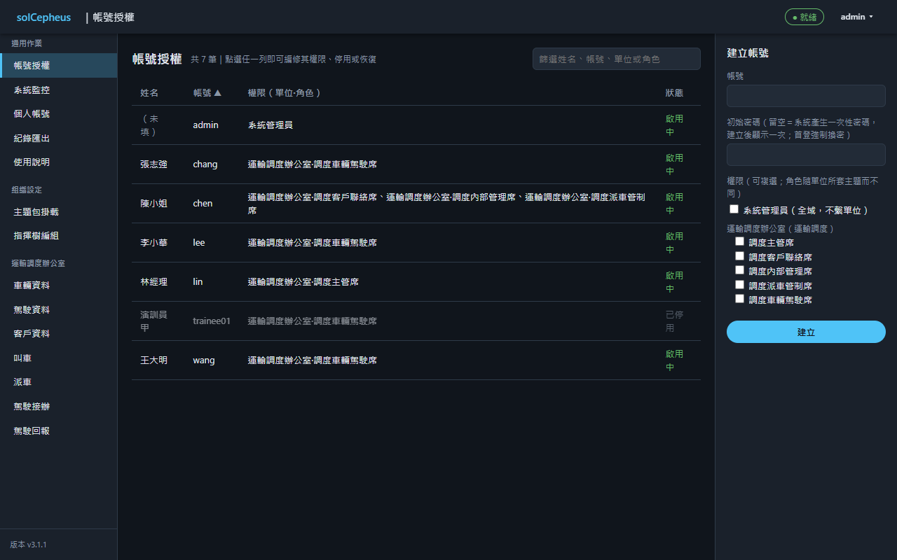

介面元件：

* `帳號清單`：共用排序、篩選與分頁（用於 [privOpr建立USR帳號](#1-privopr建立usr帳號)、[privOpr停用USR帳號](#2-privopr停用usr帳號)、[privOpr恢復USR帳號](#3-privopr恢復usr帳號)）
* `帳號編輯面板`：建立、停用、恢復與重設密碼（用於 [privOpr建立USR帳號](#1-privopr建立usr帳號)、[privOpr停用USR帳號](#2-privopr停用usr帳號)、[privOpr恢復USR帳號](#3-privopr恢復usr帳號)、[privOpr重設USR密碼](#4-privopr重設usr密碼)）
* `席指派面板`：加入或移出單位之席群組（用於 [privOpr指派群組成員](#5-privopr指派群組成員)）

##### (1) privOpr建立USR帳號

執行者：系統管理員。

1. 核對申請內容與申請人身分。
2. 建立帳號；一人一帳、禁止共用，輪班人員各開帳號。
3. 發放初始密碼，並設定首次登入須變更密碼。
4. 確認本次變更已留稽核紀錄（誰、何時、對誰、做了什麼）。

本案規則（與上列通用步驟不一致時，以本案規則為準）：

* 一人一帳、禁止共用（輪班各開帳號）

##### (2) privOpr停用USR帳號

執行者：系統管理員。

1. 確認停用事由：離任、長期未用或任務解編。
2. 停用前檢查：該帳號所屬各權限群組於停用後仍有其他啟用中帳號持有，且該帳號非未終結指名任務之被指名人；未通過者先補指派或改派，再行停用。
3. 停用帳號；停用不刪除，稽核紀錄保留。
4. 確認本次變更已留稽核紀錄（誰、何時、對誰、做了什麼）。

本案規則（與上列通用步驟不一致時，以本案規則為準）：

* 確認其所持各單位席仍有其他啟用中帳號持有，且非未終結命令之被指名人（如派車單之被指名駕駛）後停用
* 致某席無其他啟用中帳號持有，或尚為未終結命令之被指名人者，拒停並列出該席或該命令
* 所屬單位已停用或已解除該主題套用者免檢
* 任務解編即停用、復編得恢復
* 停用即時生效，不待權杖到期

##### (3) privOpr恢復USR帳號

執行者：系統管理員。

* 恢復已停用之帳號

##### (4) privOpr重設USR密碼

執行者：系統管理員。

1. 驗明申請人身分。
2. 重設密碼。
3. 設定下次登入須變更密碼。
4. 確認本次變更已留稽核紀錄（誰、何時、對誰、做了什麼）。

##### (5) privOpr指派群組成員

執行者：系統管理員。

1. 對照編制確認指派依據。
2. 將帳號指派入或移出群組；一人可屬多群組，變更即時生效。
3. 確認本次變更已留稽核紀錄（誰、何時、對誰、做了什麼）。

本案規則（與上列通用步驟不一致時，以本案規則為準）：

* 不得指派本人帳號，平台核後端服務（modCore）拒寫
* 移出席時比照停用檢查：致該席無其他啟用中帳號持有，或本帳號尚為未終結命令之被指名人者，拒寫並列出該席或該命令
* 所屬單位已停用或已解除該主題套用者免檢
* 移出即時生效，不待權杖到期


#### 3. modHmiStack系統監控頁

效益指標、系統資料唯讀查詢與日誌。

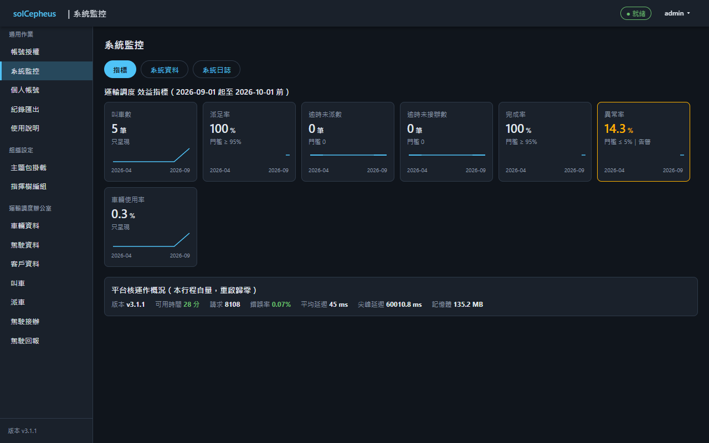

介面元件：

* `效益指標面板`：指標卡與趨勢圖（用於 [privOpr查詢效益指標](#3-privopr查詢效益指標)）
* `系統資料查詢器`：唯讀條件查詢，不得改（用於 [privOpr查詢系統資料](#4-privopr查詢系統資料)）
* `日誌檢視器`：稽核與運作日誌篩選與匯出（用於 [privOpr查詢系統日誌](#1-privopr查詢系統日誌)、[privOpr匯出系統日誌](#2-privopr匯出系統日誌)）

##### (1) privOpr查詢系統日誌

執行者：系統管理員。

1. 依時間、帳號與事件類別過濾查詢稽核與系統日誌。
2. 追溯特定事件時，交叉比對操作稽核（誰做了什麼）與系統事件（發生了什麼）。
3. 需留存者改走「refPrivOprMaint匯出系統日誌」。

本案規則（與上列通用步驟不一致時，以本案規則為準）：

* 含職責分離例外報表
* 運作日誌為各服務之容器日誌，於叢集以命令列查閱
* 核與包以結構化日誌記非 2xx 回應、上游逾時與包失聯（等級、路由、狀態碼、耗時）

##### (2) privOpr匯出系統日誌

執行者：系統管理員。

1. 依「refPrivOprMaint查詢系統日誌」過濾出需留存之範圍。
2. 依匯出格式規範匯出。
3. 依保存規範歸檔。
4. 確認匯出行為本身已留稽核紀錄。

##### (3) privOpr查詢效益指標

執行者：系統管理員。

1. 選定時間區間，查詢可用度、延遲、錯誤率、資源用量與業務量指標。
2. 對照門檻判讀；越限者確認是否已觸發告警。
3. 異常指標留存截圖或數值紀錄。後續轉入「refPrivOprMaint重啟Helm類工作負載」或「refPrivOprMaint調整Helm類系統參數」。
4. 定期彙整趨勢（版本前後對比），供容量與更新規劃。

##### (4) privOpr查詢系統資料

執行者：系統管理員。

* 唯讀查系統內紀錄與設定，不得改
* 範圍為全單位、全紀錄類別含歷史版本；使用者發起之查詢每次留稽核，系統監控頁之自動化讀取（指標）每次開啟只記一筆彙總、不逐類型逐筆記


#### 4. modHmiStack通用登入頁

帳密登入與登出，手機可用。

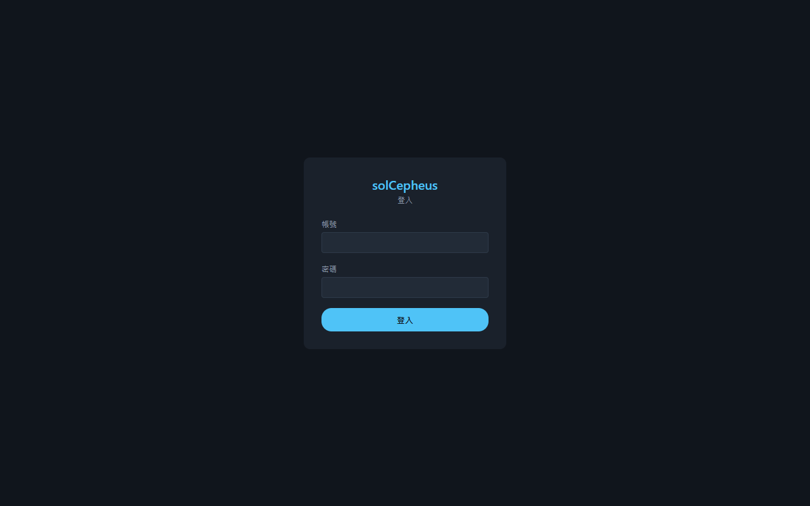

介面元件：

* `登入表單`：帳密輸入與錯誤提示（用於 [privOpr連線網頁服務](#1-privopr連線網頁服務)、[privOpr登入網頁服務](#3-privopr登入網頁服務)）
* `首登改密表單`：首次登入或密碼經重設後，須先改密碼才進得去（用於 [privOpr變更本人密碼](#2-privopr變更本人密碼)）
* `登出入口`：入口常駐外殼右上帳號選單，登出後返回本頁（用於 [privOpr登出網頁服務](#4-privopr登出網頁服務)）

##### (1) privOpr連線網頁服務

執行者：內建匿名訪客。

1. 以 HTTPS 連線入口 URL，確認憑證有效（鎖頭無警告）。
2. 首次連線成功後將入口加入書籤。
3. 連線失敗時把畫面上的錯誤訊息回報維運（口頭或拍照皆可），不重試逾三次。

##### (2) privOpr變更本人密碼

執行者：全體已登入使用者。

1. 開啟個人帳號頁。
2. 輸入原密碼與新密碼。
3. 送出後以新密碼重新登入確認。

##### (3) privOpr登入網頁服務

執行者：內建匿名訪客。

1. 首次登入依系統要求變更初始密碼。
2. 日常以帳號密碼登入；工作階段逾時後重新登入即可續作。
3. 連續失敗遭鎖定時，依「refPrivOprMaint重設USR密碼」向維運申請重設。

##### (4) privOpr登出網頁服務

執行者：全體已登入使用者。

1. 用完即登出；使用共用電腦時尤其要登出。
2. 確認頁面回到登入頁。


#### 5. modHmiStack通用帳號管理頁

個人資料與密碼變更，手機可用。

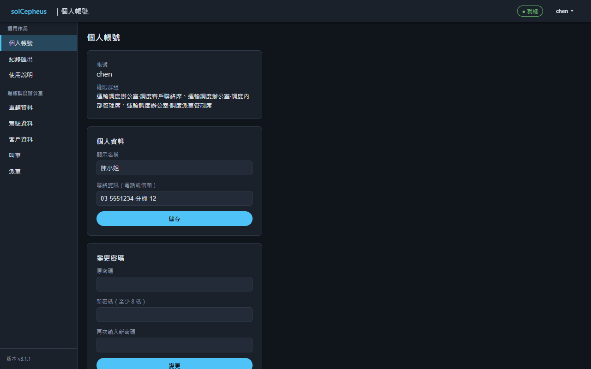

介面元件：

* `個人資料表單`：姓名、聯繫與個人偏好（用於 [privOpr維護本人資料](#1-privopr維護本人資料)）
* `密碼變更表單`：舊新密碼與強度檢核（用於 [privOpr變更本人密碼](#2-privopr變更本人密碼)）

##### (1) privOpr維護本人資料

執行者：全體已登入使用者。

1. 開啟個人帳號頁。
2. 修改顯示名稱與聯絡資訊後儲存。
3. 頁面可檢視自身所屬權限群組；有疑義向維運反映，不自行要求擴權。

本頁亦可執行：

* [privOpr變更本人密碼](#2-privopr變更本人密碼)（作法見「頁面通用登入頁」）


#### 6. modHmiStack使用說明頁

說明內文、自然語問答與關於資訊。

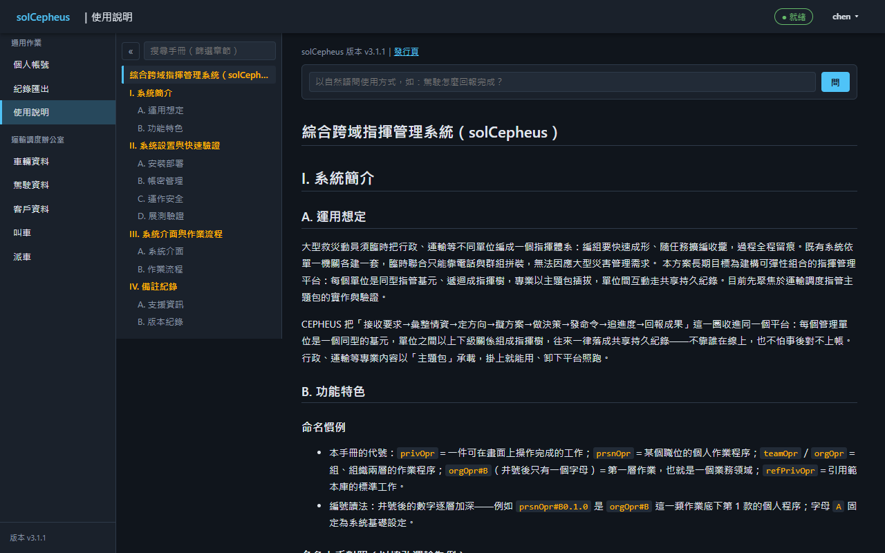

介面元件：

* `說明目錄與內文`：分節導覽與全文（用於 [privOpr檢視使用說明](#1-privopr檢視使用說明)）
* `關於資訊區`：版本號與發行頁連結（用於 [privOpr檢視使用說明](#1-privopr檢視使用說明)）
* `問答輸入框`：自然語問答〔AI輔助〕；服務不可用時回暫不可用（用於 [privOpr問答使用說明](#2-privopr問答使用說明)）

##### (1) privOpr檢視使用說明

執行者：全體已登入使用者。

* 閱使用說明

##### (2) privOpr問答使用說明

執行者：全體已登入使用者。

* 以自然語問答使用說明〔AI輔助〕


#### 7. modHmiStack紀錄匯出頁

依紀錄類與時段匯出可列印檔。

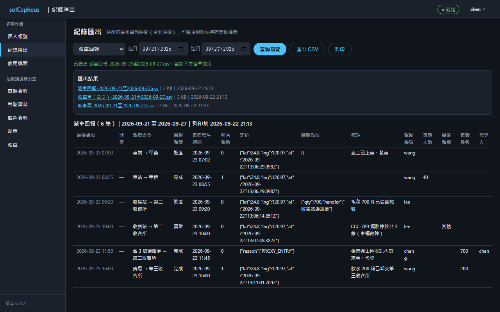

介面元件：

* `匯出條件表單`：紀錄類別與時段（用於 [privOpr匯出紀錄可列印檔](#1-privopr匯出紀錄可列印檔)）
* `匯出結果清單`：產出檔取用（用於 [privOpr匯出紀錄可列印檔](#1-privopr匯出紀錄可列印檔)）

##### (1) privOpr匯出紀錄可列印檔

執行者：全體已登入使用者。

* 依紀錄類與時段匯出可列印檔
* 可選紀錄類別限持該類讀取權者
* 結構欄之值換人看得懂之文字：座標換緯經與時刻，其餘逐子欄換類型正本宣告之子欄顯示名與代碼白話，不露原始 JSON 與英文碼


#### 8. modHmiStack主題包掛載頁

主題包熱載入與熱卸載。

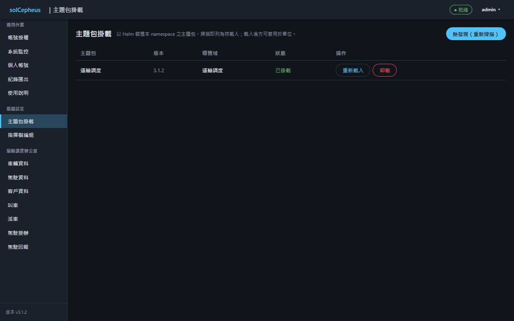

介面元件：

* `可用包清單`：已安裝之包與其掛載狀態（用於 [privOpr熱載入主題包](#1-privopr熱載入主題包)、[privOpr熱卸載主題包](#2-privopr熱卸載主題包)）
* `掛卸動作`：熱載入、熱卸載與使用中拒卸提示（用於 [privOpr熱載入主題包](#1-privopr熱載入主題包)、[privOpr熱卸載主題包](#2-privopr熱卸載主題包)）

##### (1) privOpr熱載入主題包

執行者：系統管理員。

* 熱載入已安裝之主題包
* 熱發現之新包列為待載入，不自動掛載
* 主題包升版後重新熱載入，依新宣告收整類型
* 掛載狀態持久，核重啟只恢復原已掛載者
* 原已掛載而現不可用者列為「已掛載·無回應」並附原因（未發現、收整不過、探測失敗三種），不得列為未發現或待載入（掛載狀態與可用性兩回事）；導覽同標降級

##### (2) privOpr熱卸載主題包

執行者：系統管理員。

* 熱卸載主題包
* 使用中拒卸：已有單位套用該包，或該包尚有未終結紀錄
* 已終結紀錄保留於平台核資料庫（modData），其子類型轉唯讀、仍可查詢與匯出


#### 9. modHmiStack指揮樹編組頁

以組織圖拖拉建單位、設隸屬與套用主題；草稿變更以批次發布一次生效，任一筆失敗全數不生效；發布失敗之草稿留存且錯誤提示續顯示至草稿清除或重試成功；畫布以草稿樣式標示未生效之變更，另提供捨棄草稿。

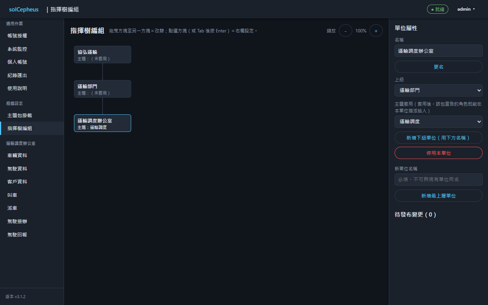

介面元件：

* `組織圖畫布`：單位方塊與隸屬連線之拖拉、縮放與自動排版（用於 [privOpr建立單位](#1-privopr建立單位)、[privOpr設定隸屬關係](#5-privopr設定隸屬關係)）
* `單位屬性欄`：選中單位之更名、上級設定、停用與恢復（用於 [privOpr建立單位](#1-privopr建立單位)、[privOpr更名單位](#2-privopr更名單位)、[privOpr停用單位](#3-privopr停用單位)、[privOpr恢復單位](#4-privopr恢復單位)、[privOpr設定隸屬關係](#5-privopr設定隸屬關係)）
* `主題套用欄`：於單位屬性欄內套用或解除主題包（用於 [privOpr套用主題](#6-privopr套用主題)、[privOpr解除主題套用](#7-privopr解除主題套用)）
* `變更發布動作`：編輯先存草稿，逐條確認後一次發布（用於 [privOpr建立單位](#1-privopr建立單位)、[privOpr設定隸屬關係](#5-privopr設定隸屬關係)、[privOpr套用主題](#6-privopr套用主題)、[privOpr解除主題套用](#7-privopr解除主題套用)）

##### (1) privOpr建立單位

執行者：系統管理員。

* 建立單位並填名稱

##### (2) privOpr更名單位

執行者：系統管理員。

* 更改單位名稱

##### (3) privOpr停用單位

執行者：系統管理員。

* 停用單位
* 尚有下級單位或未終結紀錄者拒停

##### (4) privOpr恢復單位

執行者：系統管理員。

* 恢復已停用之單位

##### (5) privOpr設定隸屬關係

執行者：系統管理員。

* 設定單位上下級

##### (6) privOpr套用主題

執行者：系統管理員。

* 為單位套用主題包

##### (7) privOpr解除主題套用

執行者：系統管理員。

* 解除單位之主題包
* 使用中拒解：單位尚有該包未終結紀錄；拒解訊息列出各筆之類型、代稱與時間，不只給筆數
* 解除套用後帳號指派保留，再套用同主題即復用


### (B) orgOpr#B-運輸調度

運輸調度專業之指管任務域。

#### 1. modHmiStack車輛資料頁

車輛檔之維護，連同車輛不可用時段。

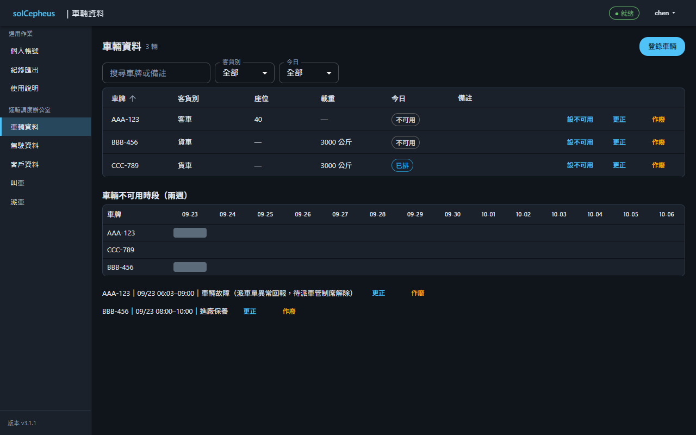

介面元件：

* `車輛總表`：各車附今日可用情形（用於 [privOpr檢視車輛檔](#1-privopr檢視車輛檔)）
* `車輛新增編輯頁`：登錄與更新（用於 [privOpr登錄車輛檔](#2-privopr登錄車輛檔)、[privOpr更新車輛檔](#3-privopr更新車輛檔)）
* `車輛作廢動作`：以新代舊寫已作廢版，不實刪（用於 [privOpr作廢車輛檔](#4-privopr作廢車輛檔)）
* `車輛不可用時段行事曆`：車輛保養、借出之檢視與登錄（用於 [privOpr檢視車輛不可用時段](#5-privopr檢視車輛不可用時段)、[privOpr登錄車輛不可用時段](#6-privopr登錄車輛不可用時段)、[privOpr更新車輛不可用時段](#7-privopr更新車輛不可用時段)、[privOpr作廢車輛不可用時段](#8-privopr作廢車輛不可用時段)）

##### (1) privOpr檢視車輛檔

執行者：調度主管席、調度內部管理席、調度派車管制席。

* 閱車輛檔與今日可用情形

##### (2) privOpr登錄車輛檔

執行者：調度內部管理席。

* 欄位：車牌、客貨別、座位數、載重
* 車牌唯一，重複由主題包後端服務（modTransSvc）拒絕

##### (3) privOpr更新車輛檔

執行者：調度內部管理席。

* 更正座位數、載重
* 客貨別不得更正，登錄錯者作廢後重新登錄，因客車、貨車分屬兩個子類型

##### (4) privOpr作廢車輛檔

執行者：調度內部管理席。

* 以新代舊寫已作廢版，不實刪

##### (5) privOpr檢視車輛不可用時段

執行者：調度主管席、調度內部管理席、調度派車管制席。

* 閱各車之保養、借出等不可用時段

##### (6) privOpr登錄車輛不可用時段

執行者：調度內部管理席。

* 設車輛不可用時段，如保養、借出

##### (7) privOpr更新車輛不可用時段

執行者：調度內部管理席。

* 更正車輛不可用時段

##### (8) privOpr作廢車輛不可用時段

執行者：調度內部管理席。

* 以新代舊寫已作廢版，不實刪


#### 2. modHmiStack駕駛資料頁

駕駛檔之維護，連同駕駛請假之檢視與核定。

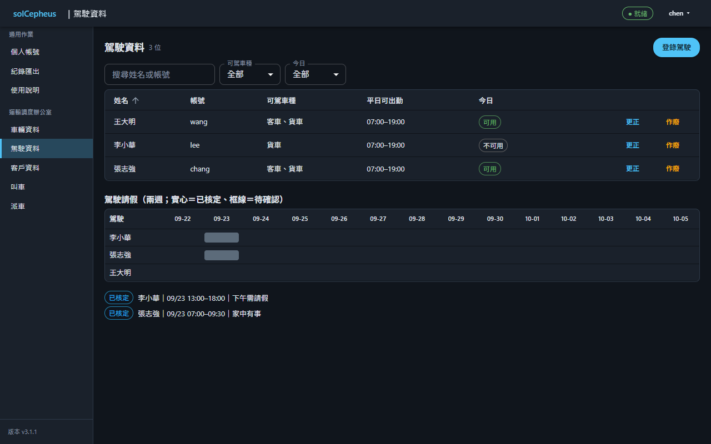

介面元件：

* `駕駛總表`：各駕駛附今日可用情形（用於 [privOpr檢視駕駛檔](#1-privopr檢視駕駛檔)）
* `駕駛新增編輯頁`：登錄與更新（用於 [privOpr登錄駕駛檔](#2-privopr登錄駕駛檔)、[privOpr更新駕駛檔](#3-privopr更新駕駛檔)）
* `駕駛作廢動作`：以新代舊寫已作廢版，不實刪（用於 [privOpr作廢駕駛檔](#4-privopr作廢駕駛檔)）
* `駕駛請假行事曆`：各駕駛之請假申請與已核定之請假時段（用於 [privOpr檢視駕駛請假](#5-privopr檢視駕駛請假)）
* `請假核定動作`：核定或退回駕駛之請假申請（用於 [privOpr核定駕駛請假](#6-privopr核定駕駛請假)、[privOpr取消駕駛請假](#7-privopr取消駕駛請假)）

##### (1) privOpr檢視駕駛檔

執行者：調度主管席、調度內部管理席、調度派車管制席。

* 閱駕駛檔與今日可用情形

##### (2) privOpr登錄駕駛檔

執行者：調度內部管理席。

* 欄位：駕駛（繫帳號）、可駕車種（客、貨）、平日可出勤時段
* 一駕駛一筆，重複由主題包後端服務（modTransSvc）拒絕；不綁定車輛
* 駕駛之帳號自本單位車輛駕駛席之成員中選取

##### (3) privOpr更新駕駛檔

執行者：調度內部管理席。

* 更正可駕車種與平日可出勤時段

##### (4) privOpr作廢駕駛檔

執行者：調度內部管理席。

* 以新代舊寫已作廢版，不實刪

##### (5) privOpr檢視駕駛請假

執行者：調度主管席、調度內部管理席、調度派車管制席、調度車輛駕駛席。

* 閱各駕駛之請假申請與已核定之請假時段

##### (6) privOpr核定駕駛請假

執行者：調度主管席。

* 主管席核定後生效並列入不可用時段；更正亦循申請與核定
* 欄位：退回原因
* 狀態變化（核定駕駛請假）：請假單由「請假待確認」轉為「請假已核定」。
* 狀態變化（核定駕駛請假）：請假單由「請假待確認」轉為「請假已回絕」。

##### (7) privOpr取消駕駛請假

執行者：調度主管席。

* 取消已核定之請假，取消後不再計入不可用
* 欄位：取消原因
* 狀態變化（取消駕駛請假）：請假單由「請假已核定」轉為「請假已取消」。


#### 3. modHmiStack客戶資料頁

客戶檔之總表、細節與新增編輯。

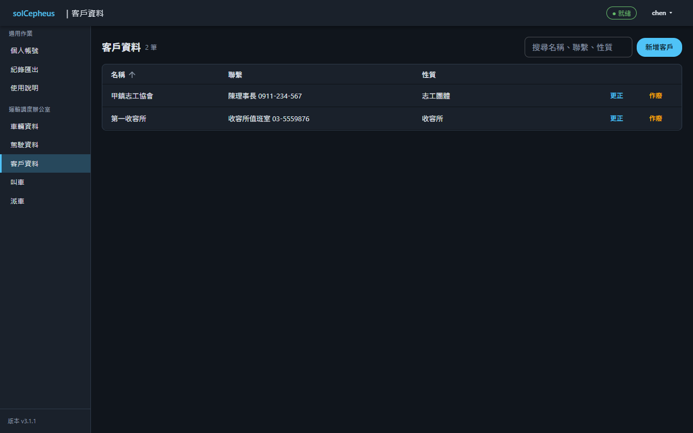

介面元件：

* `客戶總表`：客戶清單與搜尋（用於 [privOpr檢視客戶檔](#1-privopr檢視客戶檔)）
* `客戶新增編輯頁`：登錄與更新客戶檔（用於 [privOpr登錄客戶檔](#2-privopr登錄客戶檔)、[privOpr更新客戶檔](#3-privopr更新客戶檔)）
* `客戶作廢動作`：以新代舊寫已作廢版，不實刪（用於 [privOpr作廢客戶檔](#4-privopr作廢客戶檔)）

##### (1) privOpr檢視客戶檔

執行者：調度客戶聯絡席。

* 閱客戶檔

##### (2) privOpr登錄客戶檔

執行者：調度客戶聯絡席。

* 欄位：名稱、聯繫、性質

##### (3) privOpr更新客戶檔

執行者：調度客戶聯絡席。

* 更正名稱、聯繫、性質

##### (4) privOpr作廢客戶檔

執行者：調度客戶聯絡席。

* 以新代舊寫已作廢版，不實刪


#### 4. modHmiStack駕駛接辦頁

被指名駕駛以手機接辦或婉拒派車單，並申請本人請假。


介面元件：

* `派車單卡`：只列指名本人之派車單；未接辦者置頂，頁面開啟期間自動更新（用於 [privOpr接辦派車單](#3-privopr接辦派車單)、[privOpr檢視派車單](#6-privopr檢視派車單)）
* `接辦與婉拒動作`：接辦或附原因婉拒（用於 [privOpr接辦派車單](#3-privopr接辦派車單)）
* `請假申請表單`：申請本人之請假時段，並列出本人各次申請與核定結果（用於 [privOpr申請本人請假](#1-privopr申請本人請假)、[privOpr撤回本人請假](#2-privopr撤回本人請假)、[privOpr檢視駕駛請假](#5-privopr檢視駕駛請假)）

##### (1) privOpr申請本人請假

執行者：調度車輛駕駛席。

* 駕駛本人以手機申請請假時段，待核定
* 欄位：駕駛（繫本人之駕駛檔）、起訖時段、事由
* 一次請假一筆 `c2.goal.trans.leave`，初態 `cmpState#31-請假待確認`；駕駛本人持 `priv新增本人請假` 即可建立，不必持駕駛檔之更新權限

##### (2) privOpr撤回本人請假

執行者：調度車輛駕駛席。

* 駕駛本人撤回待確認之請假申請
* 限本人，他人由平台核後端服務（modCore）依本人欄拒絕
* 狀態變化（撤回本人請假）：請假單由「請假待確認」轉為「請假已撤回」。

##### (3) privOpr接辦派車單

執行者：調度車輛駕駛席。

* 接辦或婉拒派車單
* 限被指名駕駛本人，他人由平台核後端服務（modCore）依本人欄拒絕
* 欄位：婉拒原因
* 婉拒之派車單即轉已撤銷，該叫車目標列入待處理事項
* 有效派車命令數（已送出、已接辦、已完成）少於需求車數者，叫車目標仍為接辦中，由主題包後端服務（modTransSvc）列入待處理事項標需重新安排
* 狀態變化（接辦派車單）：派車單由「派車單已送出」轉為「派車單已接辦」。
* 狀態變化（接辦派車單）：派車單由「派車單已送出」轉為「派車單已撤銷」。

本頁亦可執行：

* [privOpr檢視駕駛請假](#5-privopr檢視駕駛請假)（作法見「頁面駕駛資料頁」）
* [privOpr檢視派車單](#6-privopr檢視派車單)（作法見「頁面叫車頁」）


#### 5. modHmiStack叫車頁

叫車單之受理、更正、取消與結案。

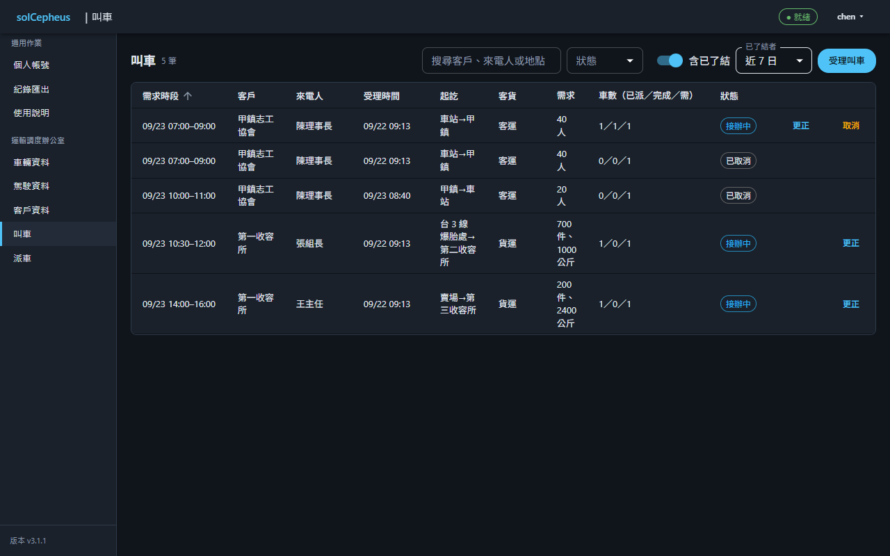

介面元件：

* `叫車單清單`：待派與在辦之叫車單，含已派、已完成之車數（用於 [privOpr檢視叫車單](#1-privopr檢視叫車單)、[privOpr檢視派車單](#6-privopr檢視派車單)）
* `叫車單新增編輯頁`：受理與更正（用於 [privOpr受理叫車單](#2-privopr受理叫車單)、[privOpr更新叫車單](#3-privopr更新叫車單)、[privOpr檢視客戶檔](#1-privopr檢視客戶檔)）
* `重複叫車告警列`：登錄或修改時即時顯示疑似重複叫車（用於 [privOpr受理叫車單](#2-privopr受理叫車單)、[privOpr更新叫車單](#3-privopr更新叫車單)）
* `取消與結案動作`：登錄客戶取消；憑完成回報結案（用於 [privOpr取消叫車單](#4-privopr取消叫車單)、[privOpr結案叫車單](#5-privopr結案叫車單)）

##### (1) privOpr檢視叫車單

執行者：調度主管席、調度客戶聯絡席、調度派車管制席。

* 閱待派與在辦之叫車單

##### (2) privOpr受理叫車單

執行者：調度客戶聯絡席。

* 受理並登錄叫車單
* 欄位：客戶（繫客戶檔）、來電人、聯繫人、受理時間、需求時段、起訖地、客貨別、需求車數、乘客人數、貨物件數與重量
* 登錄時即依疑似重複叫車規則告警（見 `privOpr檢視待處理事項`）
* 初態 `cmpState#21-叫車待確認`

##### (3) privOpr更新叫車單

執行者：調度客戶聯絡席。

* 更正叫車單
* 修改時即依疑似重複叫車規則告警（見 `privOpr檢視待處理事項`）
* 需求時段、起訖地、客貨別、需求車數或載量變更者，叫車目標狀態不動，列入待處理事項；所繫未終結之派車單不自動撤銷，由派車管制席撤銷後重新安排

##### (4) privOpr取消叫車單

執行者：調度客戶聯絡席。

* 客戶取消之登錄
* 欄位：取消原因
* 所繫未終結之派車單不自動撤銷，列入待處理事項，由派車管制席撤銷
* 狀態變化（取消叫車單）：叫車單由「叫車待確認」或「叫車接辦中」轉為「叫車已取消」。

##### (5) privOpr結案叫車單

執行者：調度客戶聯絡席。

* 憑所繫派車單之完成回報結案
* 人工動作；完成回報數達需求車數者方得結案，由主題包後端服務（modTransSvc）檢查
* 狀態變化（結案叫車單）：叫車單由「叫車接辦中」轉為「叫車已完成」；人工結案，完成回報數達需求車數者方得為之，由主題包後端服務（modTransSvc）檢查。

##### (6) privOpr檢視派車單

執行者：調度主管席、調度客戶聯絡席、調度派車管制席、調度車輛駕駛席。

* 閱派車單之狀態、指名駕駛與車、各次回報，並得列印派車單
* 回報含照片、裝載點收與定位地圖
* 派車單可列印版之要素：租車人、行程、駕駛、車號、時段
* 派車單紀錄依法保存一年

本頁亦可執行：

* [privOpr檢視客戶檔](#1-privopr檢視客戶檔)（作法見「頁面客戶資料頁」）


#### 6. modHmiStack派車頁

派車單之安排、核定、撤銷與追蹤，連同待處理事項。

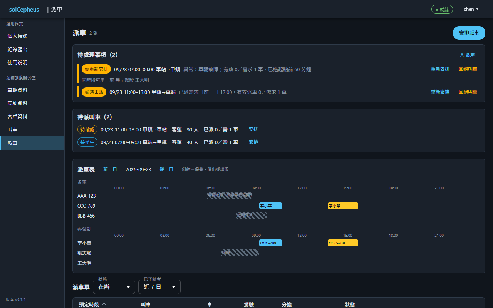

介面元件：

* `待派叫車清單`：待派之叫車單，含需求車數（用於 [privOpr檢視叫車單](#1-privopr檢視叫車單)、[privOpr安排派車單](#1-privopr安排派車單)）
* `派車表`：時段與車駕之排入格（用於 [privOpr檢視派車單](#6-privopr檢視派車單)、[privOpr安排派車單](#1-privopr安排派車單)、[privOpr檢視車輛檔](#1-privopr檢視車輛檔)、[privOpr檢視駕駛檔](#1-privopr檢視駕駛檔)、[privOpr檢視車輛不可用時段](#5-privopr檢視車輛不可用時段)、[privOpr檢視駕駛請假](#5-privopr檢視駕駛請假)）
* `AI建議動作`：取派車建議填入草擬，人得改（用於 [privOpr安排派車單](#1-privopr安排派車單)）
* `衝突告警列`：存檔與核定時即時顯示衝突與重複派車（用於 [privOpr安排派車單](#1-privopr安排派車單)、[privOpr核定派車單](#3-privopr核定派車單)）
* `派車單清單與明細`：各狀態之派車單；明細含各次回報、照片、定位地圖與列印（用於 [privOpr檢視派車單](#6-privopr檢視派車單)）
* `核定動作`：逐張核定或退回（用於 [privOpr核定派車單](#3-privopr核定派車單)）
* `撤銷動作`：撤銷派車單（用於 [privOpr撤銷派車單](#2-privopr撤銷派車單)）
* `待處理事項區`：需重新安排（附同時段可用之車與駕駛）、叫車已取消或變更、重複派車與逾時之告警（用於 [privOpr檢視待處理事項](#5-privopr檢視待處理事項)、[privOpr回絕叫車單](#4-privopr回絕叫車單)）
* `代登回報表單`：代登進度、完成、異常回報，標代登人（用於 [privOpr回報派車單](#1-privopr回報派車單)）

##### (1) privOpr安排派車單

執行者：調度派車管制席。

* 替一張叫車單配車輛、駕駛與時段，新增與修改同一件事
* 欄位：所繫叫車單、指名駕駛與車、預定時段、起訖、租車人、行程、本車分擔之乘客人數與貨物件數及重量
* 一張派車單配一車一駕駛；一張叫車單需幾台車就安排幾張，初態 `cmpState#25-派車單草擬`
* 存檔時即依衝突規則告警（見 `privOpr檢視待處理事項`）
* AI 派車建議：以待派叫車單、車輛檔、駕駛檔與可用性為上下文，經核向推論服務取得候選並填入草擬，標「AI 建議」，人得改〔AI輔助〕
* 外送欄位限需求時段、起訖地、客貨別、人數件數與重量、車輛客貨別座位載重、駕駛可駕車種與可用時段；客戶、車與駕駛一律以代號替代，不送名稱、車牌與聯繫資料
* 推論服務不可用時建議鈕停用，人工安排照常
* 系統不主動通知被指名駕駛，駕駛定期以手機瀏覽器開接辦頁查看
* 狀態變化（安排派車單）：派車單維持「派車單草擬」；修改，限草擬。
* 狀態變化（安排派車單）：派車單由「派車單已退回」轉為「派車單草擬」；重擬。
* 狀態變化（安排派車單）：派車單由「派車單草擬」或「派車單已退回」轉為「派車單已作廢」；尚未送出者由安排者自行作廢。

##### (2) privOpr撤銷派車單

執行者：調度派車管制席。

* 撤銷已送出或已接辦之派車單，被指名駕駛開接辦頁即見已撤銷
* 欄位：撤銷原因
* 改車、改人一律撤銷後重新安排
* 有效派車命令數（已送出、已接辦、已完成）少於需求車數者，叫車目標仍為接辦中，由主題包後端服務（modTransSvc）列入待處理事項標需重新安排
* 狀態變化（撤銷派車單）：派車單由「派車單已送出」或「派車單已接辦」轉為「派車單已撤銷」。

##### (3) privOpr核定派車單

執行者：調度主管席。

* 逐張核定派車單或退回重擬
* 欄位：退回原因
* 核定後系統自動送給被指名駕駛，不另設發送動作
* 派足與否由有效派車命令數（已送出、已接辦、已完成）對需求車數算出，不另設狀態
* 狀態變化（核定派車單）：派車單；連動 叫車單由「派車單草擬」轉為「派車單已核定」；隨即建決策與命令。
* 狀態變化（核定派車單）：派車單由「派車單草擬」轉為「派車單已退回」。
* 狀態變化（核定派車單）：叫車單由「叫車待確認」轉為「叫車接辦中」；首張派車命令送出時，與核定同一交易。

##### (4) privOpr回絕叫車單

執行者：調度派車管制席。

* 排不出車而不接這一筆叫車
* 欄位：回絕原因
* 接辦中者須所繫派車命令全數已撤銷方得回絕；只差幾台者，由客戶聯絡席改需求車數
* 狀態變化（回絕叫車單）：叫車單由「叫車待確認」或「叫車接辦中」轉為「叫車已回絕」；接辦中者須所繫派車命令全數已撤銷。

##### (5) privOpr檢視待處理事項

執行者：調度派車管制席。

* 閱衝突、需重新安排與逾時之告警
* 告警由主題包後端服務（modTransSvc）依固定規則判定，AI 只生成告警說明〔AI輔助〕
* 告警說明外送限規則類別與所涉之代號，說明回來後於本地換回名稱
* 只告警不擋存，人得覆寫
* 告警為即時計算之視圖，不另立紀錄；處置即撤銷後重新安排，留痕於派車單
* **衝突判定時機**：派車單存檔與核定時，對照未終結之派車單，含草擬
* **時段衝突**：同車或同駕駛時段重疊，或前趟訖時至次趟起時短於「空駛銜接緩衝」
* **資源不可用**：指派之車輛或駕駛於該時段不可用，含車輛不可用時段、已核定之請假，以及超出駕駛平日可出勤時段；平日可出勤時段每日適用，假日照常以請假處理
* **車種載量不符**：叫車單客貨別與車輛不符、本車分擔之乘客人數逾座位數、分擔之貨物重量逾載重，或駕駛不可駕該車種
* **駕駛工時超限**：同駕駛當日已完成與排定之駕車時間合計，或當日首趟起至末趟訖之勤務長度，逾「駕駛工時門檻」
* **重複派車**：同一叫車單之未撤銷派車單數超過需求車數
* **分擔不足**：同一叫車單之有效派車單，其分擔之人數、件數或重量合計少於叫車需求
* **疑似重複叫車**：登錄或修改叫車單時，同客戶已有需求時段重疊、起訖地相同之未終結叫車單
* **叫車已取消或變更**：叫車目標已取消，或其需求經修改，而所繫派車單尚未終結者，列出待撤銷之派車單
* **需重新安排**：頁面開啟與每次輪詢時，未完成之派車單其車或駕駛於該時段不可用（請假、保養），或叫車目標因修改、撤銷、婉拒、異常而有效派車命令數不足，即列出同時段可用之車與駕駛
* **逾時未派**：叫車單逾「逾時門檻」任一段，其有效派車單數（已送出、已接辦、已完成）仍少於需求車數
* **逾時未接辦**：派車單送出後逾門檻仍未接辦

本頁亦可執行：

* [privOpr檢視車輛檔](#1-privopr檢視車輛檔)（作法見「頁面車輛資料頁」）
* [privOpr檢視駕駛檔](#1-privopr檢視駕駛檔)（作法見「頁面駕駛資料頁」）
* [privOpr檢視車輛不可用時段](#5-privopr檢視車輛不可用時段)（作法見「頁面車輛資料頁」）
* [privOpr檢視駕駛請假](#5-privopr檢視駕駛請假)（作法見「頁面駕駛資料頁」）
* [privOpr檢視叫車單](#1-privopr檢視叫車單)（作法見「頁面叫車頁」）
* [privOpr檢視派車單](#6-privopr檢視派車單)（作法見「頁面叫車頁」）
* [privOpr回報派車單](#1-privopr回報派車單)（作法見「頁面駕駛回報頁」）


#### 7. modHmiStack駕駛回報頁

被指名駕駛以手機回報派車單執行情形。

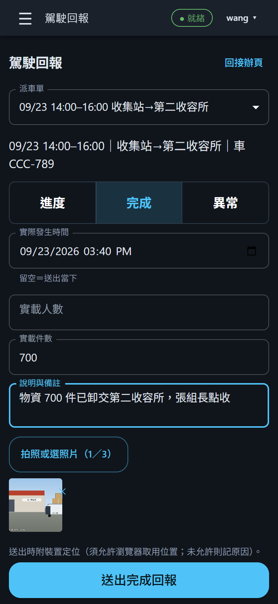

介面元件：

* `回報表單`：類型三顆分段大按鈕置頂，欄位隨類型切換（用於 [privOpr回報派車單](#1-privopr回報派車單)、[privOpr檢視派車單](#6-privopr檢視派車單)）
* `照片與定位附件`：降解析度照片與裝置定位（用於 [privOpr回報派車單](#1-privopr回報派車單)）

##### (1) privOpr回報派車單

執行者：調度派車管制席、調度車輛駕駛席。

* 進度、完成、異常三型回報，附照片與定位
* 駕駛限回報指名本人之派車單，他人由平台核後端服務（modCore）依本人欄拒絕
* 駕駛斷訊時由派車管制席憑電話代登，紀錄標代登人
* 回報欄位：類型（進度、完成、異常）、實際發生時間、人次、件數、異常類別、照片、定位、裝載點收（提貨數量、交付方經手人）
* 回報表單恆綁開啟時所指之派車單，送出後關閉表單；清單重排不得改綁他單
* 異常回報之派車單即轉已撤銷，該叫車目標列入待處理事項
* 異常類別「車輛故障」之回報同時自動登錄該車之不可用時段（起於回報時刻、迄派車管制席處置解除），可用車清單與 AI 候選即排除
* 有效派車命令數（已送出、已接辦、已完成）少於需求車數者，叫車目標仍為接辦中，由主題包後端服務（modTransSvc）列入待處理事項標需重新安排
* 狀態變化（回報派車單）：派車單維持「派車單已接辦」。
* 狀態變化（回報派車單）：派車回報由「派車單已接辦」轉為「派車單已完成」。
* 狀態變化（回報派車單）：派車單由「派車單已接辦」轉為「派車單已撤銷」。

本頁亦可執行：

* [privOpr檢視派車單](#6-privopr檢視派車單)（作法見「頁面叫車頁」）

<!-- gen:interface:end -->

## B. 作業流程

<!-- gen:flows:begin -->
### (A) orgOpr#A-系統基礎設定

#### 1. orgOpr#A1-系統安裝升級

維運部門安裝平台核與主題包，並逐版升級；升級失敗即回滾，整案狀態不變；加裝單一主題包，整案狀態不變。

##### (1) teamOpr#A1.1-平台核安裝升級（`team維運組`）

###### prsnOpr#A1.1.0-平台核安裝升級（prsn系統管理員）

* [privOpr安裝Helm類系統](#1-privopr安裝helm類系統)
* [privOpr升版Helm類系統](#2-privopr升版helm類系統)
* [privOpr回滾Helm類系統版本](#3-privopr回滾helm類系統版本)

##### (2) teamOpr#A1.2-主題包安裝升級（`team維運組`）

###### prsnOpr#A1.2.0-主題包安裝升級（prsn系統管理員）

* [privOpr安裝Helm類系統](#1-privopr安裝helm類系統)
* [privOpr升版Helm類系統](#2-privopr升版helm類系統)
* [privOpr回滾Helm類系統版本](#3-privopr回滾helm類系統版本)

#### 2. orgOpr#A2-系統設定維運

維運部門完成憑證、AI 推論服務與管理帳號之設定，並辦理日常之帳號管理與資訊安全。

##### (1) teamOpr#A2.1-系統參數設定（`team維運組`）

###### prsnOpr#A2.1.0-系統參數設定（prsn系統管理員）

* [privOpr調整Helm類系統參數](#4-privopr調整helm類系統參數)
* [privOpr設定AI推論服務](#5-privopr設定ai推論服務)
* [privOpr設定TLS憑證](#6-privopr設定tls憑證)
* [privOpr輪替機敏值](#7-privopr輪替機敏值)

##### (2) teamOpr#A2.2-全般帳號管理（`team維運組`）

###### prsnOpr#A2.2.0-全般帳號管理（prsn系統管理員）

* [privOpr建立USR帳號](#1-privopr建立usr帳號)
* [privOpr停用USR帳號](#2-privopr停用usr帳號)
* [privOpr恢復USR帳號](#3-privopr恢復usr帳號)
* [privOpr重設USR密碼](#4-privopr重設usr密碼)
* [privOpr指派群組成員](#5-privopr指派群組成員)
* [privOpr緊急復原管理帳號](#8-privopr緊急復原管理帳號)

##### (3) teamOpr#A2.3-系統資訊安全（`team維運組`）

###### prsnOpr#A2.3.0-系統資訊安全（prsn系統管理員）

* [privOpr查詢系統日誌](#1-privopr查詢系統日誌)
* [privOpr匯出系統日誌](#2-privopr匯出系統日誌)

#### 3. orgOpr#A3-系統維保檢修

維運部門定期巡檢與備份，發現故障即處理。

##### (1) teamOpr#A3.1-系統運作監控（`team維運組`）

###### prsnOpr#A3.1.1-系統運作監控（prsn系統管理員）

* [privOpr查詢效益指標](#3-privopr查詢效益指標)

###### prsnOpr#A3.1.2-系統資料讀取（prsn系統管理員）

* [privOpr查詢系統資料](#4-privopr查詢系統資料)

##### (2) teamOpr#A3.2-系統備份檢修（`team維運組`）

###### prsnOpr#A3.2.0-系統備份檢修（prsn系統管理員）

* [privOpr巡檢Helm類系統](#9-privopr巡檢helm類系統)
* [privOpr停止Helm類系統服務](#10-privopr停止helm類系統服務)
* [privOpr恢復Helm類系統服務](#11-privopr恢復helm類系統服務)
* [privOpr重啟Helm類工作負載](#12-privopr重啟helm類工作負載)
* [privOpr建立資料備份](#13-privopr建立資料備份)
* [privOpr還原資料備份](#14-privopr還原資料備份)

#### 4. orgOpr#A4-系統卸除退役

維運部門全量備份並卸除；卸除單一主題包，整案狀態不變。

##### (1) teamOpr#A4.1-平台核卸除（`team維運組`）

###### prsnOpr#A4.1.0-平台核卸除（prsn系統管理員）

* [privOpr解除安裝Helm類系統](#15-privopr解除安裝helm類系統)

##### (2) teamOpr#A4.2-主題包卸除（`team維運組`）

###### prsnOpr#A4.2.0-主題包卸除（prsn系統管理員）

* [privOpr解除安裝Helm類系統](#15-privopr解除安裝helm類系統)

#### 5. orgOpr#A5-系統終端操作

各部門人員以瀏覽器登入、管理個人帳號、匯出紀錄與查使用說明。

##### (1) teamOpr#A5.1-用戶安裝或連線（全體已登入之 `prsnOpr`）

###### prsnOpr#A5.1.0-用戶安裝或連線（內建匿名訪客）

* [privOpr連線網頁服務](#1-privopr連線網頁服務)

##### (2) teamOpr#A5.2-個人帳號管理（全體已登入之 `prsnOpr`）

###### prsnOpr#A5.2.0-個人帳號管理（全體已登入之 prsnOpr）

* [privOpr變更本人密碼](#2-privopr變更本人密碼)
* [privOpr維護本人資料](#1-privopr維護本人資料)

##### (3) teamOpr#A5.3-初次登入使用（全體已登入之 `prsnOpr`）

###### prsnOpr#A5.3.0-初次登入使用（內建匿名訪客、全體已登入之 prsnOpr）

* [privOpr變更本人密碼](#2-privopr變更本人密碼)
* [privOpr登入網頁服務](#3-privopr登入網頁服務)
* [privOpr登出網頁服務](#4-privopr登出網頁服務)
* [privOpr檢視使用說明](#1-privopr檢視使用說明)

##### (4) teamOpr#A5.4-意見回饋反映（—）

**不適用**——本版無回饋通道，列後續增量。

##### (5) teamOpr#A5.5-可再用資源管理（—）

**不適用**——各專業之資源與其不可用時段由各主題包自理，資源不跨單位共用；核只提供資料存取。

##### (6) teamOpr#A5.6-紀錄匯出（全體已登入之 `prsnOpr`）

###### prsnOpr#A5.6.0-紀錄匯出（全體已登入之 prsnOpr）

* [privOpr匯出紀錄可列印檔](#1-privopr匯出紀錄可列印檔)

##### (7) teamOpr#A5.7-使用說明問答（全體已登入之 `prsnOpr`）

###### prsnOpr#A5.7.0-使用說明問答（全體已登入之 prsnOpr）

* [privOpr問答使用說明](#2-privopr問答使用說明)

##### (8) teamOpr#A5.8-自訂檔維護（—）

**不適用**——情資實體之維護頁與商業邏輯屬各主題包，核不設通用維護頁。

#### 6. orgOpr#A6-組織設定

主題包之掛載、檢視、替換、卸載；單位建立與上下級編組。

##### (1) teamOpr#A6.1-主題包掛載管理（`team維運組`）

###### prsnOpr#A6.1.0-主題包掛載管理（prsn系統管理員）

* [privOpr熱載入主題包](#1-privopr熱載入主題包)
* [privOpr熱卸載主題包](#2-privopr熱卸載主題包)

##### (2) teamOpr#A6.2-指揮樹編組維護（`team維運組`）

###### prsnOpr#A6.2.0-指揮樹編組維護（prsn系統管理員）

* [privOpr建立單位](#1-privopr建立單位)
* [privOpr更名單位](#2-privopr更名單位)
* [privOpr停用單位](#3-privopr停用單位)
* [privOpr恢復單位](#4-privopr恢復單位)
* [privOpr設定隸屬關係](#5-privopr設定隸屬關係)
* [privOpr套用主題](#6-privopr套用主題)
* [privOpr解除主題套用](#7-privopr解除主題套用)


### (B) orgOpr#B-運輸調度

#### 1. orgOpr#B0-運輸調度

運輸調度專業之指管循環（含業務代客登錄叫車、AI 輔助之衝突告警與派車建議）。

##### (1) teamOpr#B0.1-整理車駕客戶資料（`team調度組`）

###### prsnOpr#B0.1.1-維護車輛資料（prsn調度內部管理席）

* [privOpr檢視車輛檔](#1-privopr檢視車輛檔)
* [privOpr登錄車輛檔](#2-privopr登錄車輛檔)
* [privOpr更新車輛檔](#3-privopr更新車輛檔)
* [privOpr作廢車輛檔](#4-privopr作廢車輛檔)
* [privOpr檢視車輛不可用時段](#5-privopr檢視車輛不可用時段)
* [privOpr登錄車輛不可用時段](#6-privopr登錄車輛不可用時段)
* [privOpr更新車輛不可用時段](#7-privopr更新車輛不可用時段)
* [privOpr作廢車輛不可用時段](#8-privopr作廢車輛不可用時段)

###### prsnOpr#B0.1.2-維護駕駛資料（prsn調度內部管理席）

* [privOpr檢視駕駛檔](#1-privopr檢視駕駛檔)
* [privOpr登錄駕駛檔](#2-privopr登錄駕駛檔)
* [privOpr更新駕駛檔](#3-privopr更新駕駛檔)
* [privOpr作廢駕駛檔](#4-privopr作廢駕駛檔)
* [privOpr檢視駕駛請假](#5-privopr檢視駕駛請假)

###### prsnOpr#B0.1.3-維護客戶資料（prsn調度客戶聯絡席）

* [privOpr檢視客戶檔](#1-privopr檢視客戶檔)
* [privOpr登錄客戶檔](#2-privopr登錄客戶檔)
* [privOpr更新客戶檔](#3-privopr更新客戶檔)
* [privOpr作廢客戶檔](#4-privopr作廢客戶檔)

###### prsnOpr#B0.1.4-申請本人請假（prsn調度車輛駕駛席）

* [privOpr檢視駕駛請假](#5-privopr檢視駕駛請假)
* [privOpr申請本人請假](#1-privopr申請本人請假)
* [privOpr撤回本人請假](#2-privopr撤回本人請假)

###### prsnOpr#B0.1.5-核定駕駛請假（prsn調度主管席）

* [privOpr檢視駕駛請假](#5-privopr檢視駕駛請假)
* [privOpr核定駕駛請假](#6-privopr核定駕駛請假)
* [privOpr取消駕駛請假](#7-privopr取消駕駛請假)

##### (2) teamOpr#B0.2-受理叫車（`team調度組`）

###### prsnOpr#B0.2.0-受理叫車（prsn調度客戶聯絡席）

* [privOpr檢視客戶檔](#1-privopr檢視客戶檔)
* [privOpr檢視叫車單](#1-privopr檢視叫車單)
* [privOpr受理叫車單](#2-privopr受理叫車單)
* [privOpr更新叫車單](#3-privopr更新叫車單)
* [privOpr取消叫車單](#4-privopr取消叫車單)
* [privOpr結案叫車單](#5-privopr結案叫車單)
* [privOpr檢視派車單](#6-privopr檢視派車單)

##### (3) teamOpr#B0.3-安排派車（`team調度組`）

###### prsnOpr#B0.3.0-安排派車（prsn調度派車管制席）

* [privOpr檢視車輛檔](#1-privopr檢視車輛檔)
* [privOpr檢視駕駛檔](#1-privopr檢視駕駛檔)
* [privOpr檢視車輛不可用時段](#5-privopr檢視車輛不可用時段)
* [privOpr檢視駕駛請假](#5-privopr檢視駕駛請假)
* [privOpr檢視叫車單](#1-privopr檢視叫車單)
* [privOpr檢視派車單](#6-privopr檢視派車單)
* [privOpr安排派車單](#1-privopr安排派車單)

##### (4) teamOpr#B0.4-核定派車（`team調度組`）

###### prsnOpr#B0.4.0-核定派車（prsn調度主管席）

* [privOpr檢視車輛檔](#1-privopr檢視車輛檔)
* [privOpr檢視駕駛檔](#1-privopr檢視駕駛檔)
* [privOpr檢視車輛不可用時段](#5-privopr檢視車輛不可用時段)
* [privOpr檢視駕駛請假](#5-privopr檢視駕駛請假)
* [privOpr檢視叫車單](#1-privopr檢視叫車單)
* [privOpr檢視派車單](#6-privopr檢視派車單)
* [privOpr核定派車單](#3-privopr核定派車單)

##### (5) teamOpr#B0.5-處置待處理事項（`team調度組`）

###### prsnOpr#B0.5.0-處置待處理事項（prsn調度派車管制席）

* [privOpr檢視派車單](#6-privopr檢視派車單)
* [privOpr撤銷派車單](#2-privopr撤銷派車單)
* [privOpr回絕叫車單](#4-privopr回絕叫車單)
* [privOpr檢視待處理事項](#5-privopr檢視待處理事項)
* [privOpr回報派車單](#1-privopr回報派車單)

##### (6) teamOpr#B0.6-接辦派車（`team調度組`）

###### prsnOpr#B0.6.0-接辦派車（prsn調度車輛駕駛席）

* [privOpr檢視派車單](#6-privopr檢視派車單)
* [privOpr接辦派車單](#3-privopr接辦派車單)

##### (7) teamOpr#B0.7-回報派車執行（`team調度組`）

###### prsnOpr#B0.7.0-回報派車執行（prsn調度車輛駕駛席）

* [privOpr檢視派車單](#6-privopr檢視派車單)
* [privOpr回報派車單](#1-privopr回報派車單)


<!-- gen:flows:end -->

# IV. 備註紀錄

## A. 支援資訊

<!-- gen:support:begin -->
### (A) 關於版本

* 查看執行中的版本：登入後左側導覽列底部顯示版本；未登入亦可開 `/healthz`，回應之 `version` 欄即為之。

* 各版發佈與變更說明：<https://github.com/twStellarWhale-Ocean/svcCepheus/releases>；摘要另見 ＜IV.B 版本紀錄＞。

* 版號單一正本＝repo 根 `VERSION.json`，發佈時蓋戳，不另手改。

### (B) 授權資訊

（正式發佈時自動填入發布庫的版權宣告）

### (C) 命名慣例

* 本手冊的代號：`privOpr`＝一件可在畫面上操作完成的工作；`prsnOpr`＝某個職位的個人作業程序；`teamOpr`／`orgOpr`＝組、組織兩層的作業程序；`orgOpr#B`（井號後只有一個字母）＝第一層作業，也就是一個業務領域。

* 編號讀法：井號後的數字逐層加深——例如 `prsnOpr#B0.1.0` 是 `orgOpr#B` 這一類作業底下第 1 款的個人程序；字母 `A` 固定為系統基礎設定。

### (D) 問題回報

* [產品首頁](https://github.com/twStellarWhale-Ocean/svcCepheus)

* [問題回報頁](https://github.com/twStellarWhale-Ocean/svcCepheus/issues)

* 這個管道用來回報系統本身的問題（bug）；災害現場的作業問題請循指揮體系處理，不經此管道。
<!-- gen:support:end -->

## B. 版本紀錄

<!-- gen:history:begin -->
* v3.1.2（2026-09-23）：**3.1.1 釋出前測試第 2 輪所揭 7 筆修齊**：使用說明之 AI 推論設定改寫本產品實際參數名，並載明關閉思考模式之寫法；主題包連不上時，掛載頁改標「已掛載·無回應」而非「尚未發現」，左欄導覽保留該組並標「暫時無法連線」、頁首改「降級」。
* v3.1.1（2026-09-22）：**3.1.0 釋出前測試所揭 12 筆一次修齊**：手冊安裝章補回並寫入本產品實值（chart 名、release 名、`core.url`、Secret 鍵、初始密碼讀法、TLS）；解除安裝保留 PVC 與 Secret，同名重裝沿用機敏值；運輸包手冊改七頁（駕駛回報頁補投影）；十五頁畫面改為成品截圖。
* v3.1.0（2026-09-22）：**協弘運輸調度功能投入生產運用**：需求落 design 6.0（七個指管類型、運輸包登記十一種子類型、六頁）；運輸調度一包（車輛、駕駛、客戶、叫車、派車、駕駛接辦、駕駛回報），叫車單→派車單（方案、決策、命令）→回報→結案一條線，AI 派車建議與告警說明、待處理事項、效益指標七項；徵募站、車隊、通用指管三包退場。
* v3.0.5（2026-09-10）：**3.0.4 發車審查所揭九項一次修齊**：主題包掛載頁示意圖重畫成現行畫面（導覽域中文名、使用中拒卸提示）；徵募站、車隊兩葉元包在掛載頁的導覽域改名「徵募站點」「運輸車隊」，不再同名難辨；使用說明頁改按需載入，主程式下載量減三成；產品內使用說明「關於版本」節補上實際內容（版本看哪裡、發行頁在哪）。
* v3.0.4（2026-09-10）：**產品內建使用說明頁改可導覽**：原本把 README 原文小改後平鋪成一整頁文字（表格印出管線符號、粗體與連結不渲染、無目錄無搜尋）。現在改用成熟的 markdown 渲染（react-markdown＋remark-gfm）——表格、粗體、行內程式碼、連結、程式碼區塊與頁面示意圖皆以原格式呈現；左側目錄列出章節、點選即跳、捲動時高亮目前所在章節；目錄上方的搜尋框輸入關鍵字即只留含該字的章節並標出命中字；正文限制最大行寬與行距，長文讀得下去。
* v3.0.3（2026-09-10）：**移除主題包前先檢查是否使用中**：原本在「主題包掛載頁」按下熱卸除就直接移除，已被單位套用的主題包一旦卸掉，該域與其下的紀錄即失去依附。現在卸除前系統會先查兩件事——①已有單位套用該主題、②該包的紀錄已有任何一筆——任一成立即擋下（HTTP 409），並具名列出是哪些單位在套用、哪些紀錄類別各幾筆；沒在用的包照常卸除。既有的「他包依賴本包語彙」檢查保留。
* v3.0.2（2026-09-10）：**主題包掛載頁「導覽域」欄改顯示中文域名**：原本直接印出包宣告的導覽組字串（如 `domain#3 運輸調度`），內部代號外溢到畫面，且四包兩兩共用同一代號、對維運沒有意義。改為只顯示中文域名（行政事務／運輸調度／葉端作業），完整字串留在該格的滑鼠提示供稽核。
* v3.0.1（2026-09-10）：（同版號補記，docs 不進位）**設計文件整理**：把兩個尚未實作的功能（群組管理頁、權限盤點頁）自正文移到「後續規劃」，並把所有後續規劃集中成一份清單；功能與安裝方式皆無變動。
* v3.0.1（2026-09-10）：（同版號補記，refactor 不進位）**mod 模組全面改名**：目錄、程式路徑、Dockerfile、`package.json` name、開發腳本與測試 import 一次改齊。模組改依所屬系統命名：核心模組以功能命名（modWui／modCore），主題包模組以「域＋Page／Svc」命名（如 modOprPage／modTransSvc）。安裝方式、chart values、映像名皆不變，使用者不需任何操作。`sysCore/modWeb`→`modWui`；`sysPackGeneric/modPackWui`→`modOprPage`、`modPackSvc`→`modOprSvc`；`sysPackTransport/modPackWui`→`modTransPage`、`modPackSvc`→`modTransSvc`；`sysLeafStation/modPackWui`→`modStationLeafPage`、`modPackSvc`→`modStationLeafSvc`；`sysLeafFleet/modPackWui`→`modFleetLeafPage`、`modPackSvc`→`modFleetLeafSvc`。
* v3.0.1（2026-08-27）：**主題包 chart 之 `core.url` 改必填**——原預設值是 `http://{本 release 名}-core:8080`，而**包與核必然是不同 release**（Helm release 名在同一 namespace 不得重複），這個預設**永遠不可能對**：包 svc 因此連不到核，所有包頁面的 API 呼叫一律 401「權杖驗證未過」。改為 `required`，沒給值即安裝當場報錯，不裝出一個連不到核的包。
* v3.0.0（2026-08-27）：**權限模型改「角色×單位」（破壞性）**：原本把單位名黏進角色名（`prsn行政組長`），靠套主題時人工填的「編制前綴」湊唯一性——業界標準是角色與範圍兩個維度，壓成一個字串後，只要前綴不是包裡寫死的樣本值，就**建得出編制卻派不了人**（展測實撞）。改為：包只宣告角色（`組長`／`聯絡官`／`駕駛`…），單位由指揮樹給，帳號授權頁以「單位＋角色」逐對指派。
* v2.1.3（2026-08-27）：版號收斂為單一正本：VERSION.json 以外的 20 處（六個模組 package.json、四個 mount.json、五支 chart 之 version／appVersion／image tag）改由 testScripts/stampVersion.py 蓋戳，並附 --check 機判擋漂移（實撞：發 2.1.2 時核在展測機自報 2.1.0）；同時砍掉只會漂的第二版戳 BUILD_ID，healthz 一律回報 version。
* v2.1.2（2026-08-27）：發車漏洞閘回修：五個映像 apk upgrade 收 alpine 基底修復版（libcrypto3／libssl3 3.5.8-r0），並移除執行期用不到的內建 npm CLI——10 筆 HIGH／CRITICAL 中 8 筆出自 npm 自身相依（brace-expansion／tar／undici／ip-address），啟動指令為 node、留著只是徒增攻擊面。
* v2.1.1（2026-08-27）：主題包收編改為反覆收編至無進展為止——依賴鏈兩層（generic→transport→fleetleaf）在單輪排序下會讓車隊葉元包被跳過，只印「重掃再試」而無任何機制重掃，冷開機後該包靜默缺席（展測機實裝實撞）；開機掃描改掛 app.locals.packsReady 以便等待。
* v2.1.0（2026-08-27）：design 5.2 完整落地：通用指管包重工至新語彙（五官組長制、work 詞、收辦循環三態）；新增運輸調度包（六頁）與徵募站、車隊兩葉元包（手機優先接辦回報、照片 Base64＋定位）；命令狀態機八態（無法接辦／中途回報／異常回報／撤銷）；跨包收發依信封受文單位自動列示、受領繫鏈；套主題自動實例化編制群組；帳號停用在辦防呆；宣告式狀態機驗證與並發樂觀鎖入核；chart 依 sol-sys 命名法改制（sysopr／systrans／sysstationleaf／sysfleetleaf，母 chart 依 design 移除）。
* v2.0.0（2026-08-19）：打掉重練（breaking）：依 rshAcademicPapers/paperC2RefModel 立論重作全系統——walking skeleton 最小可運行系統與新版 design 2.0 基線。
* v1.1.3（2026-08-15）：論文遷出本 repo（chore，無玩家可見行為變更）：`docs/research/` 全數移至獨立私有庫 `twMoonBear-Laboratory/rshAcademicPapers`，以 `git subtree split` 保留該路徑之 28 筆提交歷史。
* v1.1.2（2026-08-04）：docs/ 三分（chore，無玩家可見行為變更）：`docs/design/`（design.md、shared-contracts、design-visual）／`docs/manual/`（手冊來源，圖併其 assets/）／`docs/research/`（論文）。對齊 skill 標準樹（kdbUserSkills#177）。
* 更早期的版本（v1.1.1 以前）：詳見 git 紀錄。
<!-- gen:history:end -->
