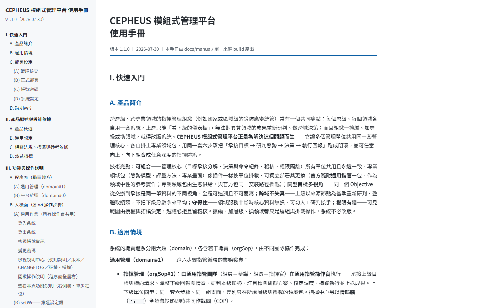
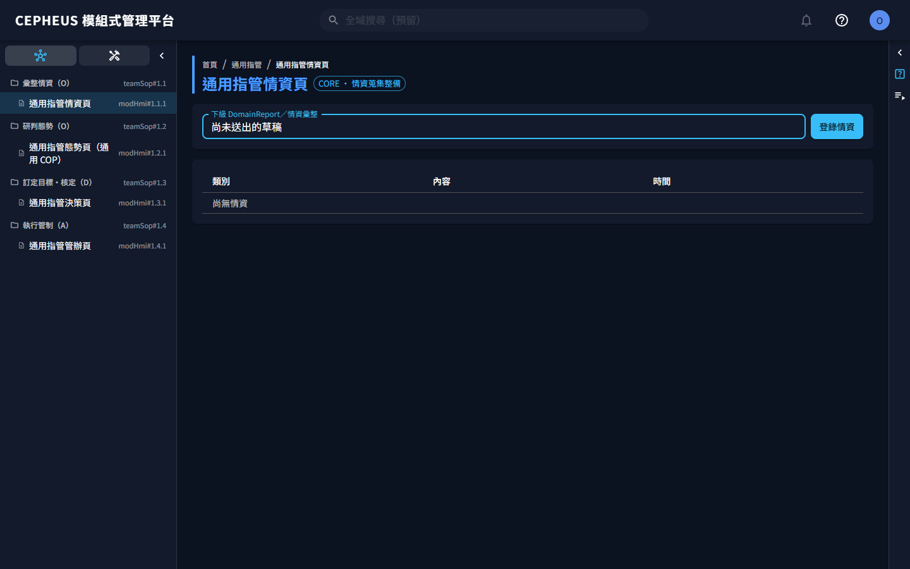
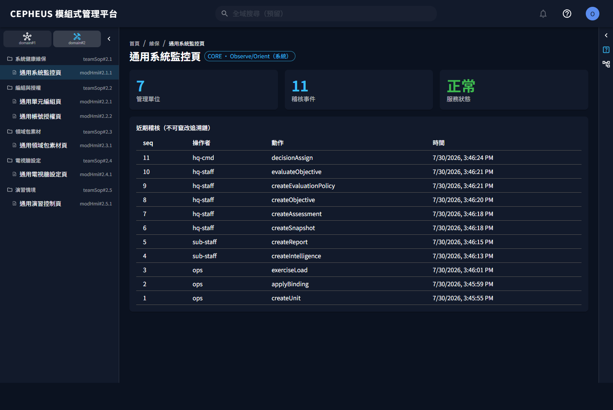
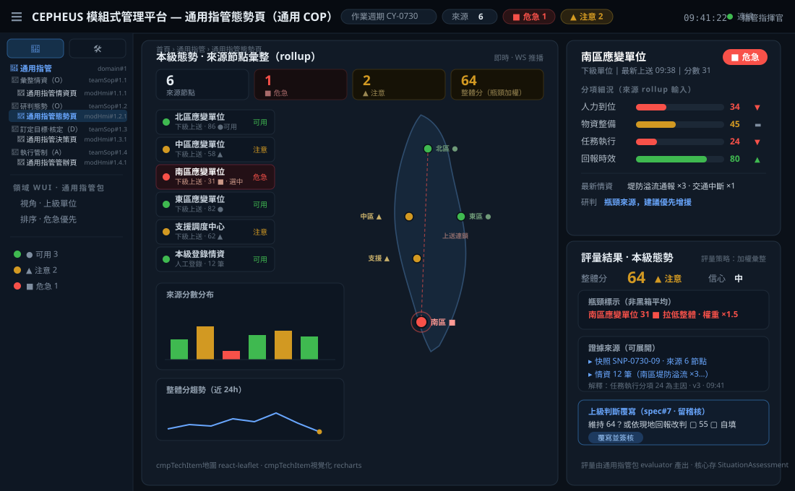
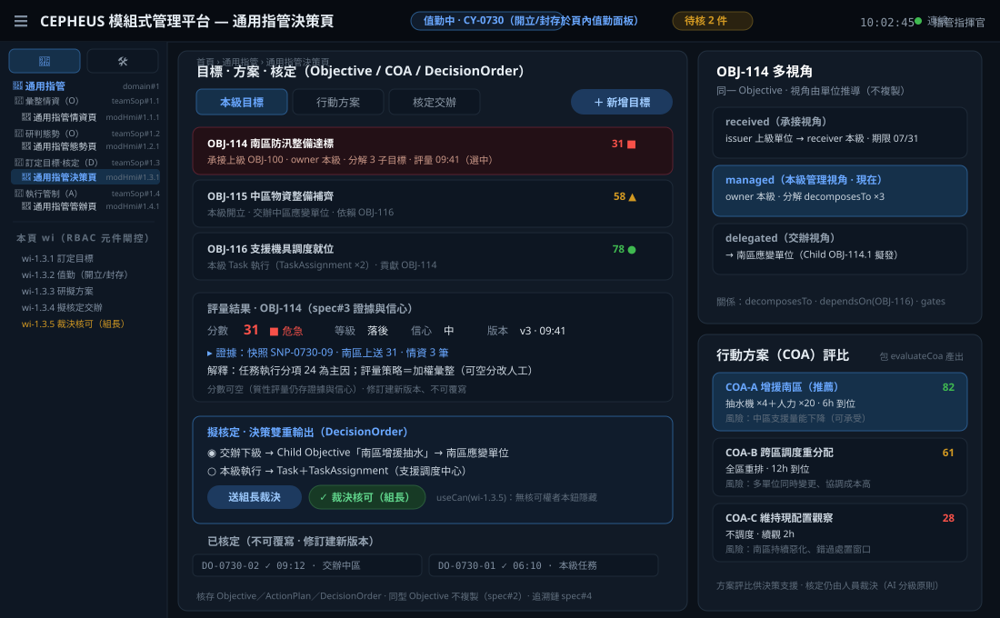
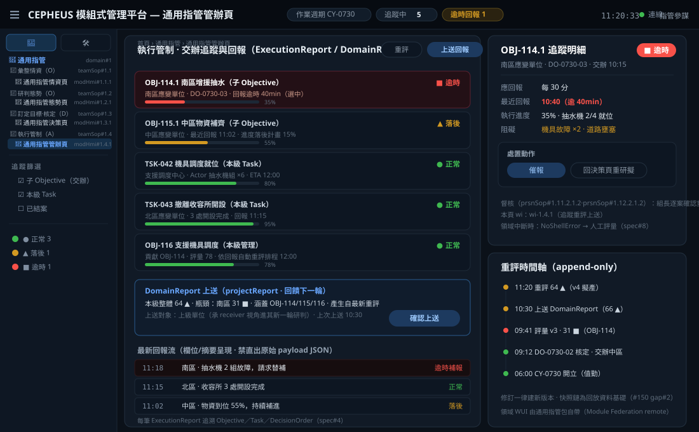
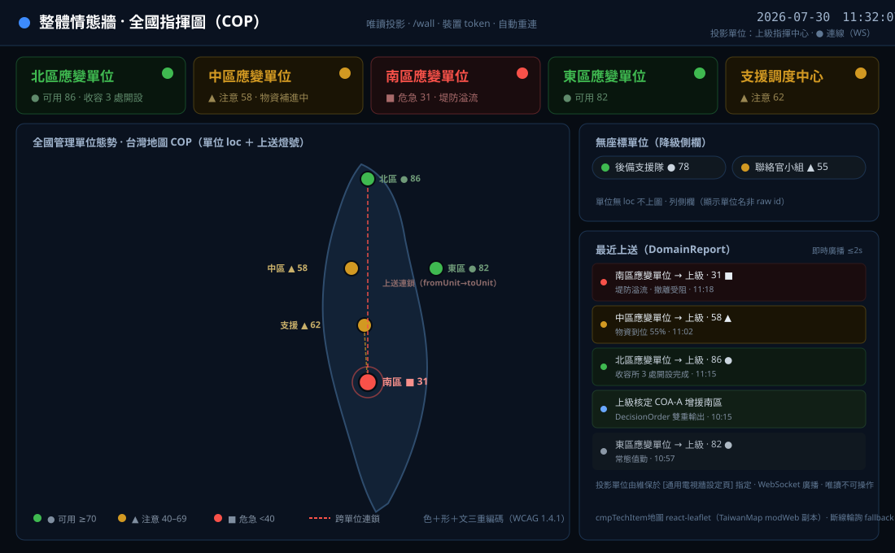
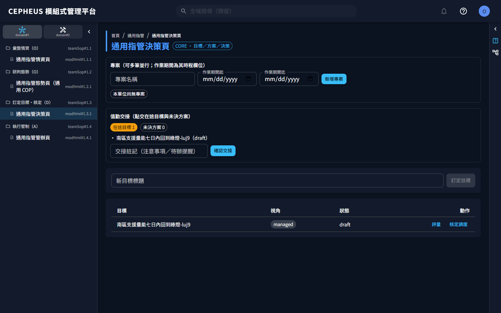

# CEPHEUS 模組式管理平台 — 可組合跨域指揮管理（solCepheus）

> 📘 **完整使用手冊**：[PDF 版（含完整目錄）](docs/manual/solCepheus-manual.pdf) ｜ 站內版 `/manual/`（登入後自說明中心（右上角 `?`）開啟、直達當前頁說明）
> 手冊涵蓋部署、登入到每一步操作的逐項說明與畫面；本 README 為對應的入口簡介。



## 產品概述

**CEPHEUS 模組式管理平台**（開發代號 `solCepheus`；下述技術脈絡沿用代號）讓一個跨層級、跨專業領域的指揮管理組織，在**同一套平台**上運作：每個管理單位承接上級目標（Objective）、研判自己領域的態勢、做出決策，再把成果回報上去。單位要增加、層級要加深、領域要更換，都用**圖形化編組與掛載**完成，不必改版系統。

平台把「指揮管理」拆成兩件事：

- **管理核心**：所有單位共用的目標承接、決策、任務、回報與稽核紀錄——這部分不分領域、永遠一致。
- **領域包**：各領域的態勢模型、評量方法與專業畫面——像插件一樣掛到單位上，可獨立部署、獨立更換。**官方隨附「通用指管」領域包**（領域中性的參考實作：來源彙整、自動評量與通用 COP 畫面）；資安、戰略綜管、人力、後勤等**專業領域包由生態供給**，與官方包同一安裝路徑掛載。

本版（MVP）為**純核心平台＋官方通用指管包**：以上下兩級管理單位，驗證從單一單位六步驟一圈到多層承接、上級重評交辦的完整運作。（本版收斂：原官方資安／戰略綜管／後勤示範三包已移出本庫、歸生態外掛；其中資安／戰略綜管之已發佈舊版 chart 仍留存於 GHCR〔見安裝章〕、後勤示範未曾發佈。）

**定位**：災防為首要適用情境——本版由通用指管包＋災防演練情境承載；專業災防深化（水文圖層、外部情資源正式介接等）由生態領域包擴充。

## 運用想定

指揮結構沿層級堆疊（層級由編組拓樸推導、不寫死），本版以**上下兩級通用管理單位**驗證：

- **上級單位**匯整下級回報與外部事件，重評本級態勢與整體目標（顯示來源與瓶頸、不做黑箱平均），下達子目標。
- **下級單位**承接上級目標，跑自己的六步驟一圈（情資→態勢→目標→方案→決策→執行回報），成果上送。
- **專業領域**（資安、戰略綜管、人力、後勤…）由生態專業包承接——掛上哪個包，該單位就長出哪個領域的專業畫面與評量。

你在平台上的角色：

| 你是…… | 你會…… |
|---|---|
| **指管指揮官／指管參謀（上級單位）** | 在通用指管操作台匯整下級回報與外部事件、重評本級態勢與整體目標（來源與瓶頸一目瞭然、可覆寫調整）、核定方案、下達子目標並追蹤重評 |
| **指管指揮官／指管參謀（下級單位）** | 在同一套通用指管操作台承接上級目標、蒐整本級情資、研判態勢、訂定目標、核定執行、彙整回報上送 |
| **維運工程師／維運組長** | 以 Helm CLI 部署與升級平台；在維運台開帳號與授權隔離、拖拉編組管理單位拓樸、掃描登記與套用領域包、設定電視牆、監控健康與查閱稽核；備份還原走 CLI（還原等破壞性動作二人覆核、卸載領域包獨立核可）；並以**超級使用者**身分開啟任一領域操作台（所見與指揮官一致），支援排障與展示講解——維運帳號具名不共用、寫入操作全程留稽核 |
| **指揮中心（電視牆）** | 情態牆全螢幕投影即時共同作戰圖（COP）——下級回報上送後**數秒內**自動反映（WebSocket 推播；斷線自動退回輪詢並重連） |
| **展示對象／受訓學員** | 用維運指派進演習子樹的一般帳號登入，從說明中心開啟操作說明——依職責層層展開（領域→職責→作業→操作）點哪跳哪，在預鋪模擬情境的真實介面上體驗 |

## 安裝（Kubernetes／Helm）

系統以 Helm chart 部署到你的 Kubernetes 叢集：可用 umbrella chart 一鍵裝核心＋官方通用指管包，也可核心與各領域包分開裝。安裝分三步：跑環境檢查 → `helm install` → 裝後確認。

**安裝前環境檢查（請先跑）**：檢查兩件事——（1）叢集**預設 IngressClass**：chart 的 `ingress.className` 預設留空＝交給預設 ingress controller，只在叢集真的有標「預設 IngressClass」時有效（k3s 內建 traefik 出廠即標；ingress-nginx 官方安裝**不標**——留空會產生沒人認領的孤兒 Ingress、網址無聲 404）；（2）**kube-dns（CoreDNS）ClusterIP**：modWeb 反代領域包 WUI 需正確的叢集 DNS resolver（chart 預設為 k3s 的 `10.43.0.10`，kubeadm／EKS／GKE 常為 `10.96.0.10`——不符時領域包 WUI 反代解析失敗、態勢頁掉通用畫面、症狀與「包壞了」難以區分）。安裝前請先跑下列檢查腳本（**整段複製執行**——分段貼上會沿用舊變數而誤判），依輸出指引安裝：

腳本輸出的 `--set` 依你的安裝動線擇一：**umbrella 一鍵安裝**用 `solcepheus-syscore-chart.ingress.*` 開頭的鍵；**核心 chart 單獨安裝**用 `ingress.*` 開頭的鍵（鍵擺錯層值透不進去，等同沒設）。

bash 版：

```bash
# solCepheus 安裝前環境檢查：偵測叢集預設 IngressClass（請整段複製執行）
if ! CLASSES=$(kubectl get ingressclass -o name 2>/dev/null); then
  echo "[X] kubectl 連不上叢集：請先確認 kubeconfig 與叢集狀態（kubectl get nodes）再重跑本檢查。"
else
  DEFAULT=$(kubectl get ingressclass -o jsonpath='{range .items[*]}{.metadata.name}{"\t"}{.metadata.annotations.ingressclass\.kubernetes\.io/is-default-class}{"\n"}{end}' 2>/dev/null | awk -F'\t' '$2=="true"{print $1}')
  NDEFAULT=$(printf '%s' "$DEFAULT" | grep -c .)
  if [ -z "$CLASSES" ]; then
    echo "[X] 叢集沒有任何 IngressClass：請先安裝 ingress controller（如 ingress-nginx／traefik），或安裝時停用 Ingress 改走 port-forward——umbrella 加 --set solcepheus-syscore-chart.ingress.enabled=false（核心 chart 單獨裝則 --set ingress.enabled=false），裝後 kubectl port-forward svc/modweb 8080:80 開 http://localhost:8080。"
  elif [ "$NDEFAULT" -eq 1 ]; then
    echo "[OK] 叢集預設 IngressClass=${DEFAULT}：ingress.className 留空即可，直接安裝。"
  elif [ "$NDEFAULT" -gt 1 ]; then
    echo "[!] 叢集標了多個預設 IngressClass（${DEFAULT//$'\n'/、}）——留空會被 K8s 拒絕建立，請明示其一：umbrella 加 --set solcepheus-syscore-chart.ingress.className=<名>（核心 chart 單獨裝則 --set ingress.className=<名>）。"
  else
    echo "[!] 叢集有 IngressClass 但未標預設：umbrella 安裝加 --set solcepheus-syscore-chart.ingress.className=<名>（核心 chart 單獨裝則 --set ingress.className=<名>）。可用名稱："
    echo "${CLASSES}" | sed 's|ingressclass.networking.k8s.io/||'
  fi
fi
# (2) kube-dns（CoreDNS）ClusterIP：modWeb 反代領域包所需之 resolver（chart 預設 k3s 之 10.43.0.10）
DNS=$(kubectl get svc -n kube-system kube-dns -o jsonpath='{.spec.clusterIP}' 2>/dev/null)
if [ -z "$DNS" ]; then
  echo "[!] 查不到 kube-dns Service ClusterIP（叢集 DNS 可能改名）：請手動查你的 CoreDNS/kube-dns Service ClusterIP，若非 10.43.0.10 則安裝加 --set solcepheus-syscore-chart.modWeb.dnsResolver=<值>（核心 chart 單獨裝用 --set modWeb.dnsResolver=<值>）。"
elif [ "$DNS" = "10.43.0.10" ]; then
  echo "[OK] kube-dns ClusterIP=10.43.0.10 與 chart 預設相符：modWeb.dnsResolver 免設。"
else
  echo "[!] kube-dns ClusterIP=${DNS} 與 chart 預設 10.43.0.10 不同——不覆寫會使領域包 WUI 反代解析失敗、態勢頁掉通用畫面。安裝加 --set solcepheus-syscore-chart.modWeb.dnsResolver=${DNS}（核心 chart 單獨裝用 --set modWeb.dnsResolver=${DNS}）。"
fi
```

PowerShell 版（Windows PowerShell 5.1 與 PowerShell 7 皆可）：

```powershell
# solCepheus 安裝前環境檢查：偵測叢集預設 IngressClass（請整段複製執行）
$raw = kubectl get ingressclass -o json 2>$null
if ($LASTEXITCODE -ne 0 -or -not $raw) {
  Write-Host "[X] kubectl 連不上叢集：請先確認 kubeconfig 與叢集狀態（kubectl get nodes）再重跑本檢查。"
} else {
  $items = @(($raw | ConvertFrom-Json).items)
  $default = @($items | Where-Object { $_.metadata.annotations.'ingressclass.kubernetes.io/is-default-class' -eq 'true' })
  if ($items.Count -eq 0) {
    Write-Host "[X] 叢集沒有任何 IngressClass：請先安裝 ingress controller（如 ingress-nginx／traefik），或安裝時停用 Ingress 改走 port-forward——umbrella 加 --set solcepheus-syscore-chart.ingress.enabled=false（核心 chart 單獨裝則 --set ingress.enabled=false），裝後 kubectl port-forward svc/modweb 8080:80 開 http://localhost:8080。"
  } elseif ($default.Count -eq 1) {
    Write-Host "[OK] 叢集預設 IngressClass=$($default[0].metadata.name)：ingress.className 留空即可，直接安裝。"
  } elseif ($default.Count -gt 1) {
    Write-Host "[!] 叢集標了多個預設 IngressClass（$($default.metadata.name -join '、')）——留空會被 K8s 拒絕建立，請明示其一：umbrella 加 --set solcepheus-syscore-chart.ingress.className=<名>（核心 chart 單獨裝則 --set ingress.className=<名>）。"
  } else {
    Write-Host "[!] 叢集有 IngressClass 但未標預設：umbrella 安裝加 --set solcepheus-syscore-chart.ingress.className=<名>（核心 chart 單獨裝則 --set ingress.className=<名>）。可用名稱："
    $items | ForEach-Object { Write-Host $_.metadata.name }
  }
}
# (2) kube-dns（CoreDNS）ClusterIP：modWeb 反代領域包所需之 resolver（chart 預設 k3s 之 10.43.0.10）
$dns = kubectl get svc -n kube-system kube-dns -o jsonpath='{.spec.clusterIP}' 2>$null
if (-not $dns) {
  Write-Host "[!] 查不到 kube-dns Service ClusterIP（叢集 DNS 可能改名）：請手動查你的 CoreDNS/kube-dns Service ClusterIP，若非 10.43.0.10 則安裝加 --set solcepheus-syscore-chart.modWeb.dnsResolver=<值>（核心 chart 單獨裝用 --set modWeb.dnsResolver=<值>）。"
} elseif ($dns -eq "10.43.0.10") {
  Write-Host "[OK] kube-dns ClusterIP=10.43.0.10 與 chart 預設相符：modWeb.dnsResolver 免設。"
} else {
  Write-Host "[!] kube-dns ClusterIP=$dns 與 chart 預設 10.43.0.10 不同——不覆寫會使領域包 WUI 反代解析失敗、態勢頁掉通用畫面。安裝加 --set solcepheus-syscore-chart.modWeb.dnsResolver=$dns（核心 chart 單獨裝用 --set modWeb.dnsResolver=$dns）。"
}
```

> 註：預設 IngressClass 只在 Ingress 物件**建立當下**蓋章——若曾以 `--set ingress.className=<名>` 安裝、之後叢集補標了預設想改回留空，須讓 Ingress 物件重建才會被預設 controller 接手：先 `kubectl delete ingress modweb`、**再** `helm upgrade`（Helm 會重建缺失的 Ingress；controller 不會自行重建被刪的物件，順序顛倒會讓對外入口一直斷到下次 upgrade。注意 upgrade 時勿帶 `--reuse-values` 或舊的 `--set ingress.className`，否則留空不會生效）。

一鍵聚合安裝（核心＋官方通用指管包，安裝程序自動完成包登記；chart 直接從 GHCR 取得，不需下載原始碼）：

```bash
helm install cepheus oci://ghcr.io/twstellarwhale-ocean/solcepheus-chart --version 0.1.21 \
  --set solcepheus-syscore-chart.ingress.baseDomain=你的網域   # 對外網址＝solcepheus.你的網域；純內網/port-forward 可省略（詳下方 Ingress 段）
```

或核心（零領域包）與各領域包分開安裝——各包自帶 image／chart、可單獨升級替換：

```bash
helm install cepheus-core   oci://ghcr.io/twstellarwhale-ocean/solcepheus-syscore-chart   --version 1.1.1
helm install pack-generic   oci://ghcr.io/twstellarwhale-ocean/solcepheus-syspackgeneric-chart --version 0.1.0
```

> **釘版安裝（可重現）**：上列 `--version` 為 **v1.1.1** 班車釘定值。chart version 與內含平台版（appVersion）對照如下——umbrella 只需釘自身 `--version`，子 chart 版本由其相依鎖定：
>
> | 安裝物 | chart | chart version | 內含平台版（appVersion） |
> |---|---|---|---|
> | 一鍵 umbrella | `solcepheus-chart` | `0.1.21` | `1.1.1` |
> | 核心（零領域包） | `solcepheus-syscore-chart` | `1.1.1` | `1.1.1` |
> | 通用指管領域包 | `solcepheus-syspackgeneric-chart` | `0.1.0` | `0.1.0` |
>
> 各版 chart version 與 appVersion 的完整對照見該版 [GitHub Release](https://github.com/twStellarWhale-Ocean/svcCepheus/releases) 說明。舊版資安／戰略綜管包 chart（`solcepheus-syspackcyber-chart`／`solcepheus-syspackstrategy-chart`）仍留存於 GHCR 供既有部署，惟不再隨本庫更新。

裝好後確認：modCore `/healthz` 回 200、modWeb 首頁可載入、素材頁可見官方通用指管包「可達／**已登記未套用**」；有啟用 Ingress 者另跑 `kubectl get ingress modweb` 確認 `CLASS` 欄**不是** `<none>`（`<none>`＝孤兒 Ingress、對外網址會無聲 404，請回頭跑上方環境檢查）。

> **「已登記未套用」是新裝的正確狀態、不是故障**：安裝程序只做「登記」（讓平台知道有官方通用指管包），至於「把包套用到哪個管理單位」是你的編組決策——請登入後於領域包素材頁自行套用（見下方〈走一圈看看〉步驟 1）。**尚未套用時，該單位的態勢頁會顯示核心內建通用畫面（無殼 fallback、人工評量）＝正常降級、非故障**；套用通用指管包後才會換上包自帶的畫面與自動評量（如通用指管態勢頁的台灣地圖 COP）。

> **安裝需要網路**：chart 內的 image 指向 GHCR（`ghcr.io/twstellarwhale-ocean/…`，public），叢集安裝時會直接自 GHCR 拉取。GitHub Release 附的 chart `.tgz`（含 SHA256）可先下載留存與驗證，但目前**不支援全離線安裝**——拉取 image 仍需對外網路；封閉網段部署請先把 image 匯入你的私有 registry，再以 `--set` 覆寫各 image 位址。
>

> **對外可達（Ingress）**：chart 預設附 opt-in Ingress（`ingress.enabled: true`），將外部 `host → modweb:80`；app 內部 path 路由（`/api`、`/packs/{slug}`、SPA）仍由 modWeb nginx 處理。
>
> - **host**：預設由 `solcepheus.<baseDomain>` 鏈導出（`baseDomain` 預設中性值 `local`，chart 不硬編任何公開網域）——請以 `--set ingress.baseDomain=你的網域` 一處設定共用網域值，即得對外 host `solcepheus.你的網域`；host 要完全自訂時改 `--set ingress.host=你要的host`（優先於預設鏈）。**用 umbrella 一鍵安裝時鍵名須帶子 chart 前綴**（`--set solcepheus-syscore-chart.ingress.baseDomain=…`，見下）。
> - **controller（`className`）**：預設**留空** → 交給叢集的**預設 IngressClass**（前提是叢集有標預設——k3s traefik 出廠即標、免 `--set`；ingress-nginx 官方安裝**不標**，須 `--set ingress.className=nginx`）；同叢集多 controller 也須明示。**裝前請先跑上方「安裝前環境檢查」腳本**，依輸出決定要不要帶 `--set`。
> - **邊緣須先備妥**（chart **不含**邊緣本體，二擇一）：① **外部邊緣終結 TLS**（如 Cloudflare Tunnel：萬用 `*.<baseDomain>` 設定一次、之後掛 app 不再碰邊緣）→ 維持預設 `ingress.tls=false`、`ingress.issuer=""`（TLS 在邊緣）；② **自架 ingress-nginx＋cert-manager** → `--set ingress.issuer=<ClusterIssuer>`（chart 自動加 `cert-manager.io/cluster-issuer` annotation 並產 TLS，例 DuckDNS ACME issuer）。
> - **純內網／`kubectl port-forward`**：`--set ingress.enabled=false` 回退 ClusterIP-only、不產生 Ingress 物件。
> - umbrella 於 `solcepheus-syscore-chart.ingress` 透傳同組值（如 `--set solcepheus-syscore-chart.ingress.baseDomain=你的網域`）。

### 升級既有部署

已裝過本平台（如既有 `cepheus` release）要升到本版時，用 `helm upgrade`——同名 release 再跑 `helm install` 會直接報錯：

```bash
helm upgrade cepheus oci://ghcr.io/twstellarwhale-ocean/solcepheus-chart --version 0.1.21 \
  --set solcepheus-syscore-chart.ingress.baseDomain=你的網域   # 安裝時帶過的 --set 請全數重帶（查法見下）
```

> **升級注意**：
>
> - **安裝時帶過的 `--set` 請全數重帶**：升級指令一旦帶了任何 `--set`／`-f`，未重帶的值就會回落 chart 預設（勿用 `--reuse-values`）。不記得當初帶了哪些？`helm get values cepheus` 會列出全部自訂值；`helm list` 可查現行版本（判斷是否落在下一條的版界內）。
> - 自 **v0.22.0（含）以前**升級、且金鑰原用預設值（未曾自管 `secrets.jwtSecret`）者：JWT 簽章金鑰會自動輪替為強隨機值（安全整治），**既有登入 session 全數失效、需重新登入**，屬預期行為非故障；已自管強金鑰者不受影響。
> - 其餘各版升級注意（含改名遷移）見裝後 NOTES「升級注意」段、[`CHANGELOG.md`](CHANGELOG.md) 與各版 Release notes。

**核心 chart 自本版更名**：`solcepheus-syscore-chart`（原 `solcepheus-syscepheus-chart` 依「不刪已發佈」凍結於 GHCR、不再更新）；自更名前版本升級＝以新 chart 名安裝、沿用既有資料庫與 PVC（`helm uninstall` 舊 release 時務必**保留 PVC**——chart 預設 `paramRetainOnUninstall=true`，再以新名 `helm install` 並指向同一 PVC；詳見完整使用手冊「部署／升級」節）。分開安裝者同理：對 `cepheus-core`／`pack-generic` 各自 `helm upgrade` 至上方版號對照表之 chart version。既有部署裝有舊資安／戰略綜管包者：該二包不再隨本庫更新，續用或改掛生態包由你決定，核心升級不受影響（包與核心 release 解耦）。

> 逐步安裝、參數與疑難排解，見完整使用手冊「快速入門」與「功能與操作說明」；歷次版本的升級注意事項（含改名遷移）見 [`CHANGELOG.md`](CHANGELOG.md) 與各版 Release notes。

> 登入逾時（token 失效、伺服器重啟等）時系統會自動登出並導回登入頁、提示「登入逾時，請重新登入」；權限不足（403）不會登出、在原頁就地提示。

## 走一圈看看（使用者旅程）

以維運 → 下級單位 → 上級單位 → 電視牆的順序，把平台跑一輪（本版各態勢研判以人工登錄／示範資料演算；接入真實情資源屬後續增量）。〔標「設計參考稿」之圖為示意（SVG），其餘為本版實機截圖〕：

**1. 維運台——把組織搭起來。** 在通用單元編組頁用拖拉方式編組管理單位拓樸（層級由拓樸自動推導），在領域包素材頁掃描探索叢集內的領域包、確認登記，再套用到指定單位：


編輯類頁面（單元編組、電視牆設定、變更密碼、決策草稿〔無殼 fallback 版〕）皆有**未存變更離開守衛**：有尚未儲存的變更時，切換頁面／登出／關閉分頁會先提示「捨棄未儲存的變更？」〔捨棄並離開／留在本頁〕，避免誤觸離開而遺失（領域包自渲染之頁面其守衛列後續版本）：



越權操作（缺少所需權限 wi）被伺服器拒絕（403）時，除原頁就地提示「權限不足」外，**該拒絕事件亦寫入不可竄改稽核鏈**（操作者／方法／路徑／原因），於監控頁「近期稽核」可查——兌現「越權留稽核」：



維運帳號同時是**超級使用者**：左側導覽看得到全部領域操作台，開任一域頁所見與該域指揮官一致——用於掌握全系統實況、重現使用者回報的介面問題；維運帳號具名不共用、操作全程留稽核。

**2. 下級單位——跑一輪六步驟。** 掛通用指管包的下級單位從情資蒐集開始（人工登錄／匯入＋下級回報），在通用指管態勢頁的台灣地圖 COP 上看各來源節點的位置與燈號、rollup 分項與瓶頸（點選任一來源看分項細況），接著訂目標、擬方案、核定執行、彙整回報上送。態勢燈號**色＋形＋文三重編碼（無障礙）**：整體分、危急／注意計數、地圖標記與選中來源燈號皆帶形狀（`●`／`▲`／`■`）與文字，不以顏色為唯一資訊管道（WCAG 2.1 §1.4.1〔Level A〕）；平台原生畫面與通用指管包畫面共用同一嚴重度契約：



**專案與值勤交接——把作業框起來。** 通用指管決策頁的「管理專案」讓各單位自建與選定本單位**專案**（新增／編修／選定、多筆並行——一個 `Project` 承載一段作業，六步驟的目標與工作都掛屬所選專案；正線運作起點不再只能靠演習載入或直呼 API，各單位僅編修自己的專案）；輪替時另有**值勤交接**——點交在途目標與未決方案、產出交接摘要並留稽核（一個 `Project` 承載一段作業，取代舊版之「單一作業期間 session」）。決策頁對每個目標按「評量」即呈現**評量結果面板**——分數（可空＝未量化）、等級、**信心**、可展開的**證據來源**（回溯至來源情資／快照）、解釋與版本時間；讓指揮官看得到「這個建議有多少把握、根據什麼」，而非只有一個工單狀態（spec#3 證據與信心）：



**3. 上級單位——重評與交辦。** 上級單位匯整下級 DomainReport 與外部事件，經評量策略重評本級態勢與整體目標——來源與瓶頸一目瞭然、上級判斷可覆寫調整（不是把下級分數拿來黑箱平均），核定後下達子目標、依回報追蹤重評：



**4. 情態牆——讓指揮中心看見。** `/wall` 全螢幕投影即時 COP（各單位態勢標記＋跨單位連鎖線＋最近上送流）：



態勢嚴重度**色＋形＋文三重編碼（無障礙）**——燈號不以顏色為唯一資訊管道：每個標記與圖例同時帶**形狀**（`●` 可用／`▲` 注意／`■` 危急）與**文字標籤**，紅綠色覺障礙者與遠距投影牆／小螢幕亦可辨嚴重度（WCAG 2.1 §1.4.1 Use of Color〔Level A〕；上圖 COP 之單位標記即帶形＋分數）。

其餘畫面：[登入](docs/manual-assets/wi-0-1.png)｜[通用指管情資頁（設計參考稿）](docs/design-visual/page-generic-intel.svg)｜[領域包素材頁（掃描探索）](docs/manual-assets/wi-3-8-1.png)｜[系統監控頁](docs/manual-assets/wi-3-1-1.png)｜[外部領域包叢集探索](docs/manual-assets/10-pack-discover-dialog.png)｜[外部領域包登記（叢集）](docs/manual-assets/11-pack-external-registered.png)｜[登入逾時提示](docs/manual-assets/12-login-expired.png)｜[API 錯誤友善呈現](docs/manual-assets/13-friendly-error.png)｜[情態牆認證失效自動重試](docs/manual-assets/14-wall-authfail.png)｜[演習導覽（橫幅＋浮水印）](docs/manual-assets/15-exercise-banner.png)｜[重置後訪客導出](docs/manual-assets/16-exercise-reset-expired.png)｜[領域包中斷時域頁降級通用頁（不白屏）](docs/manual-assets/17-pack-wui-fallback.png)——每個操作步驟的畫面見完整使用手冊。

> 介面右上角：全域搜尋與告警（本版為預留介面）、**說明中心**（`?` 開站內 [通用說明頁]：使用說明·開手冊·開啟操作說明／版本資訊／CHANGELOG／版權·授權）、**帳號選單**（帳號資訊／變更密碼／登出）。
> 介面**右側欄**（可收合）固定兩個分頁，一個看**當頁**、一個看**全站**：**功能說明**——跟著你所在的頁面走，垂直條列本頁的每一項作業（顯示碼＋完整名稱，一眼看得出是什麼），選定一項再看它的逐步操作，點某一步就在畫面上高亮該去哪裡；**操作說明**——不隨頁面切換的全站作業樹，依「領域 → 組織職責 → 小組作業 → 個人作業 → 工作指導」層層展開，點任一項直接跳到該項的實際畫面。左側功能選單依「分類（圖示頁籤）→ 功能類別 → 功能頁」層層對應、各層有圖示，也可收合成細軌讓主畫面滿版（職責視角的樹在右側「操作說明」分頁，與左欄各自獨立）。


功能說明分頁於每列標該作業的 **SOP 顯示碼**（碼與完整名稱同列），左側功能選單各層亦帶顯示碼弱化 token（滑鼠停留顯層級全名）——其中**只有 wi 碼與手冊錨一對一**（點號／連字號為同一編號兩形）；其餘層級碼為畫面內的層級指示，與手冊的 SOP 編號不同源：


> 每頁頁首有**麵包屑**（`首頁 / 區段 / 當前頁`）：點「首頁」回到**你登入後的落點**（維運人員→系統監控頁；指管人員→你單位領域的態勢頁；已在落點時「首頁」不可點）；中段為所屬區段標籤（不可點）、末段為當前頁。帳號資訊與說明頁不屬任一區段，縮為 `首頁 / 當前頁`。

## 演習／展示模式

系統功能完整但複雜，所以內建演習/展示能力，讓展示、採購評估、教育訓練與新人上手不必從空系統開始：

1. **載入情境**：維運在演習控制頁挑一張情境卡片（本版內建「上下級聯合演練」，領域中性）按載入，整個平台立刻被模擬資料灌滿——情資有告警、態勢有燈號、目標有內容、任務進行中，全部在真實介面上操作；載入後由維運把訪客／學員的一般帳號**指派**進演習單位子樹（與正式授權互斥），登入即可體驗。情境是資料資產（一情境一 JSON），新增情境不必改程式。
2. **依職責層層展示**：從說明中心（`?`）按「開啟操作說明」，右側滑出**操作說明面板**——依「領域 → 組織職責 → 小組作業 → 個人作業 → 工作指導」層層展開系統全部作業（各層標 SOP 編號、依作業順序排列），點哪一項就直接跳到那一項的實際畫面，展示時照著樹逐項點給現場看。你目前權限到不了的項目會灰化為講解型，點選只顯說明、不跳頁。


3. **放心演、隨時重來**：演習資料掛在專屬的演習單位子樹下，與正式運作互相看不見；被指派進演習的帳號畫面全程有「演習/展示模式 · 資料為模擬」色帶橫幅與浮水印。按重置即封存本輪（演習授權隨之撤銷）、可再載入重來，**不會刪除或影響任何正式紀錄**。正在做正式作業的使用者完全不受演習影響、也不會看到演習標示。

> 操作說明是登入後的產品能力（不載入演習情境也能逐項跳頁看，只是頁面沒料）；登入頁不設任何操作說明或手冊入口。


操作步驟見完整使用手冊「載入／重置演習情境」「檢視說明中心」「開啟操作說明」各節。

## 效益

用了 solCepheus，你的組織會得到：

- **擴編不改版**：新增管理單位、加深層級、換掛領域包，都是編組與掛載操作，系統不必改版重佈。
- **目標一條鏈**：同一個目標從上級交辦到下級承接是同一筆資料的不同視角，不複製、不漂移；從情資到回報全程可追溯、正式紀錄不可竄改。
- **專業可插拔**：所有領域包（官方通用指管包與生態專業包同級）都是獨立部署的外掛（自帶 image／chart／畫面），裝上去、換版本，核心一字不改；核心 release 本身零領域包。
- **重評不失真**：上級以評量策略重評下級成果——來源與瓶頸攤在眼前、上級判斷可覆寫，明確禁止「把下級分數拿來黑箱平均」的假統管。
- **出事守得住**：領域服務中斷時核心目標、命令、任務、回報無損，可切人工研判接手，恢復後留有完整稽核。
- **權限有牆**：可見範圍由授權與拓樸決定，越權必拒且留下稽核紀錄。
- **錯誤不嚇人**：登入逾時自動導回重登、不卡在失效畫面；操作錯誤一律顯示可理解的文案，不會蹦出原始 API 回應。
- **展示訓練不冒險**：內建演習情境連正式環境都能安全展示——模擬資料與正式運作隔離、明確標示、重置不損任何紀錄；隔離用的正是系統自己的單位授權機制，演習本身就是隔離能力的展示。

各項效益的量測方式與驗收證據，見完整使用手冊附錄。

## 本版尚未提供

以下為指管系統常見、但**本版未實作**的能力——列出以免被誤讀為故障（Top App Bar 的「全域搜尋」「告警」為預留控件、目前停用）：

- **時間軸／回放**：歷史—現況—預估沿時間軸檢視。
- **圖層開關**：地圖圖層可視控制（本版底圖與標記固定）。
- **告警受理狀態機**：告警分級呈現有，但無受理／處置流轉。
- **多行動方案並列比較／兵推**：本版單一方案研擬與核定。

## 部署與文件

- 開發 repo：私有（twMoonBear-Laboratory/solCepheus）。
- 部署：核心為單一 Helm release（`sysCore/deploy`，零領域包）；所有領域包各自 image／chart 獨立 `helm install`（官方包與第三方同級），維運台可掃描探索並確認掛載；umbrella chart 提供核心＋官方包一鍵安裝。
- 機密：`secrets.jwtSecret`、`secrets.dbPassword` 於部署時設定；`secrets.adminPassword`（正式初始管理帳號）留空＝安裝時自動隨機生成、取回方式見裝後 NOTES。
- 正式（pg）部署**預設不內建示範帳號與示範編組**——上述示範帳號僅本機開發模式；首裝以初始管理帳號登入後自行編組。umbrella 之包自動登記走專用機器帳號（隨機密碼存 Secret，不落 values 明文；GitOps／CD 環境請以 `registrar.existingSecret` 引用既有 Secret，並同步設 `solcepheus-syscore-chart.modCore.registrarSecret=<同名>`）。自 v0.19.1 含以前版本升級者：資料庫內既有 `demo1234` 示範帳號請登入後逐一改密（系統開機偵測到會於日誌與稽核告警；帳號停用功能列後續版本）。
- 版本與改版紀錄：[`VERSION`](VERSION)／[`CHANGELOG.md`](CHANGELOG.md)；手冊附錄同步引用。
